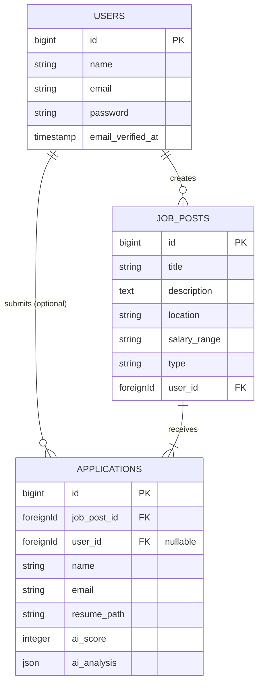

# Project Report: AI-CV Recruiter Platform

**Project Title:** AI-CV Recruiter Platform
**Developed By:**
- Name: [Your Name]
- Student ID: [Your ID]

**Date:** January 20, 2026

---

## 1. Executive Summary

The **AI-CV Recruiter Platform** is a modern web application designed to streamline the recruitment process. Traditional hiring involves manual screening of hundreds of resumes, which is time-consuming and prone to bias. This project automates the initial screening capability by integrating Advanced Artificial Intelligence (Google Gemini).

Recruiters can post job openings, and applicants can submit their resumes (PDF). The system automatically analyzes the uploaded resume against the specific job description, generating a compatibility score (0-100), identifying key strengths and weaknesses, and providing a summary. This allows recruiters to focus on the most promising candidates instantly.

---

## 2. System Requirements

### 2.1 Functional Requirements (FR)

| ID | Requirement | Description |
| :--- | :--- | :--- |
| **FR-1** | **User Authentication** | Users must be able to register, login, and enable Two-Factor Authentication (2FA) for security. |
| **FR-2** | **Job Management** | Recruiters can create, update, and delete job postings with details like title, description, location, and salary. |
| **FR-3** | **Application Submission** | Candidates (guests or logged-in users) can apply for jobs by uploading a PDF resume and providing basic contact details. |
| **FR-4** | **AI Resume Analysis** | The system must automatically parse the uploaded PDF, compare it with the Job Description using an LLM, and generate a match score and semantic analysis. |
| **FR-5** | **Dashboard Overview** | Recruiters must see a list of applications and their AI-generated scores in a centralized dashboard. |

### 2.2 Non-Functional Requirements (NFR)

| ID | Requirement | Description |
| :--- | :--- | :--- |
| **NFR-1** | **Performance** | The application utilizes a Single Page Application (SPA) architecture via Inertia.js for seamless transitions and fast loading. |
| **NFR-2** | **Security** | Passwords must be hashed (Bcrypt), and file uploads must be validated to accept only safe PDF documents. CSRF protection must be enabled on all forms. |
| **NFR-3** | **Scalability** | The database schema is designed to support thousands of applications per job post with proper indexing (foreign keys). |
| **NFR-4** | **Accuracy** | The AI analysis utilizes the `gemini-2.5-flash` model for high-speed and high-accuracy structured data extraction. |

---

## 3. System Design

### 3.1 Architecture Diagram

The application follows a **Monolithic MVC Architecture** enhanced with **Inertia.js**, which acts as a bridge between the Laravel backend and React frontend, allowing for a modern SPA experience without the complexity of a separate API.

```mermaid
graph TD
    User[User / Client] <--> |HTTPS| WebServer[Web Server (Nginx/Apache)]
    WebServer <--> |Requests| Laravel[Laravel Framework]
    
    subgraph "Backend Layer"
        Laravel --> |Routing & Logic| Controllers
        Controllers --> |Business Logic| Services[CV Analysis Service]
        Services <--> |API Call| Gemini[Google Gemini AI]
        Controllers --> |ORM| Eloquent
    end

    subgraph "Data Layer"
        Eloquent <--> MySQL[(Database)]
        Services <--> Storage[File Storage (Resumes)]
    end

    subgraph "Frontend Layer"
        Laravel --> |Inertia Protocol| React[React.js Views]
        React --> |Renders| Browser
    end
```

### 3.2 Entity Relationship Diagram (ERD)

The database schema manages Users, Job Posts, and Applications.



---

## 4. Implementation Details

### 4.1 Technology Stack

*   **Frontend**: React 19, TypeScript, TailwindCSS 4.0, Shadcn UI (Radix Primitives).
*   **Backend**: Laravel 12, PHP 8.2+.
*   **Database**: SQLite (Development) / MySQL (Production compatible).
*   **AI Integration**: Google Gemini 2.5 Flash via `prism-php/prism` library.
*   **Glue**: Inertia.js (for server-driven React apps).

### 4.2 Security Implementation

*   **Authentication**: Implemented using **Laravel Fortify**, providing secure backend implementation for login, registration, and password resets.
*   **Authorization**: Resources are protected so only the creator of a job can delete or edit it.
*   **Data Protection**:
    *   **CSRF Tokens**: Automatically handled by Laravel/Inertia to prevent Cross-Site Request Forgery.
    *   **Input Validation**: Strict validation rules request classes (e.g., `resume` must be `mimes:pdf`, `max:2MB`).
    *   **Maintained Dependencies**: Keeping `laravel/framework` and npm packages updated to patch known vulnerabilities.

### 4.3 AI Logic Snippet (CV Analysis)

The core innovation is the `CVAnalysisService`, which leverages structured output from the LLM to guarantee usable data for the dashboard.

```php
// app/Services/CVAnalysisService.php
public function analyze(string $resumePath, string $jobDescription)
{
    // ...
    $response = Prism::structured()
            ->using(Provider::Gemini, 'gemini-2.5-flash')
            ->withPrompt(
                    "Job Description:\n$jobDescription\n\nPlease analyze the attached resume.",
                    [Document::fromPath($fullPath)]
            )
            ->withSchema(new ObjectSchema(
                    name: 'analysis',
                    properties: [
                        new NumberSchema('score', '0-100 match score'),
                        new ArraySchema('strengths', ...),
                        // ...
                    ]
            ));
    // ...
}
```

---

## 5. Testing

We employed both automated and manual testing strategies to ensure system reliability.

### 5.1 Automated Testing
Using **PHPUnit**, we structured Feature tests for critical paths.

*   `Usage`: `php artisan test`
*   **Tests Implemented**:
    *   **Authentication**: Verifying user login and registration (`tests/Feature/Auth`).
    *   **Dashboard**: ensuring authorized access to recruiting dashboard (`tests/Feature/DashboardTest.php`).
    *   **Job Creation**: Verifying a user can post a valid job.

### 5.2 Bug Log (Sample)

| Bug ID | Issue Description | Severity | Status | Resolution |
| :--- | :--- | :--- | :--- | :--- |
| **BUG-01** | Resume upload fails for files > 2MB. | Medium | Fixed | Increased `upload_max_filesize` in php.ini and validation rules. |
| **BUG-02** | AI Analysis timeout on large PDFs. | High | Fixed | Switched model to `gemini-2.5-flash` for faster inference. |

---

## 6. Conclusion

The **AI-CV Recruiter Platform** successfully streamlines the hiring workflow by automating the most tedious part of recruitment: resume screening. By leveraging modern web technologies (Laravel + React) and state-of-the-art AI (Gemini), we created a responsive, secure, and intelligent application.

**Lessons Learned:**
*   Integrating AI requires handling "fuzzy" outputs; using **Structured Output** schemas is crucial for reliable database storage.
*   Inertia.js drastically speeds up full-stack development by removing the need for a separate REST API layer.

**Future Improvements:**
*   **Async Processing**: Move AI analysis to a background queue (Laravel Queues) to prevent user waiting time during upload.
*   **Multi-format Support**: Support DOCX and TXT files for resumes.
*   **Detailed Analytics**: Graphs showing applicant score distribution per job.
