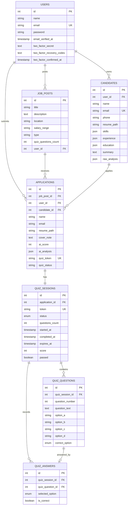
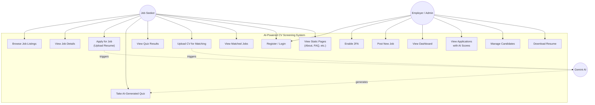
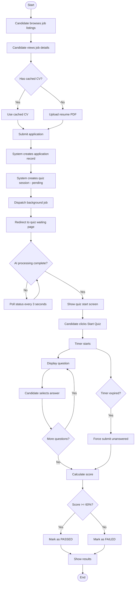
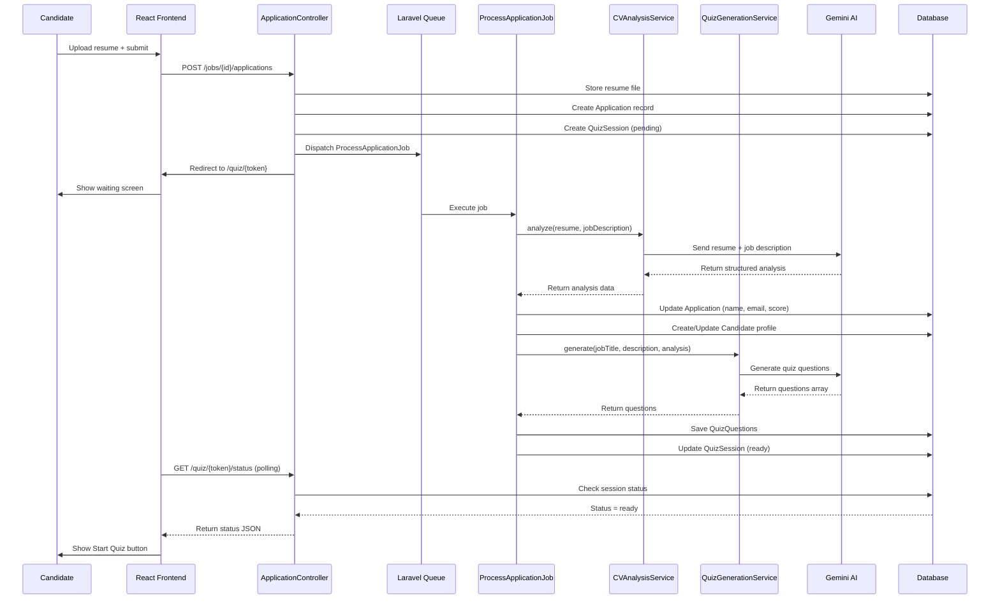
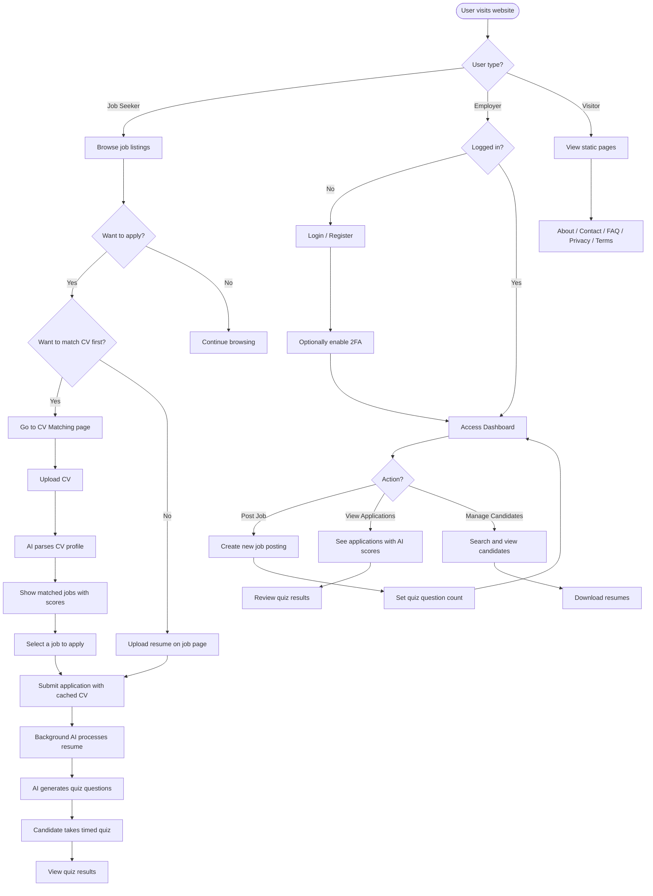

# **AI-Powered CV Screening and Smart Recruitment System**

---

## **COVER PAGE**

---

<div align="center">

### **Northern University Bangladesh**
### **Department of Computer Science and Engineering**

<br>

### **Project Title:**
## **AI-Powered CV Screening and Smart Recruitment System**

<br>

**Submitted By:**

| Name | Student ID |
|------|-----------|
| Student Name 1 | ID-XXXXXXXXXX |
| Student Name 2 | ID-XXXXXXXXXX |
| Student Name 3 | ID-XXXXXXXXXX |

<br>

**Supervisor:**
**[Supervisor Name]**
Lecturer / Assistant Professor
Department of Computer Science and Engineering
Northern University Bangladesh

<br>

**Submission Date:** July 2026

**Academic Session:** Spring 2026

</div>

---

<div style="page-break-after: always;"></div>

## **APPROVAL PAGE**

---

<div align="center">

### **Northern University Bangladesh**
### **Department of Computer Science and Engineering**

<br>

### **Certificate of Approval**

</div>

This is to certify that the project entitled **"AI-Powered CV Screening and Smart Recruitment System"** has been submitted by the following students for the partial fulfillment of the degree of **Bachelor of Science in Computer Science and Engineering** from the Department of Computer Science and Engineering, Northern University Bangladesh, and has been found satisfactory.

<br>

**Submitted By:**

| Name | Student ID | Signature |
|------|-----------|-----------|
| Student Name 1 | ID-XXXXXXXXXX | ______________ |
| Student Name 2 | ID-XXXXXXXXXX | ______________ |
| Student Name 3 | ID-XXXXXXXXXX | ______________ |

<br>

**Approved By:**

<br><br>

______________________________
**[Supervisor Name]**
Supervisor
Department of Computer Science and Engineering
Northern University Bangladesh

<br><br>

______________________________
**[Head of Department Name]**
Head of Department
Department of Computer Science and Engineering
Northern University Bangladesh

<br><br>

______________________________
**External Examiner**

---

<div style="page-break-after: always;"></div>

## **DECLARATION**

---

We hereby declare that this project entitled **"AI-Powered CV Screening and Smart Recruitment System"** has been carried out by us under the supervision of **[Supervisor Name]**, Department of Computer Science and Engineering, Northern University Bangladesh, for the partial fulfillment of the degree of Bachelor of Science in Computer Science and Engineering.

We further declare that:

1. This project is our original work and has not been submitted anywhere else for any degree or diploma.
2. All the information and materials included in this project are either our own work or have been properly acknowledged and cited.
3. We have followed all the ethical guidelines and academic integrity policies of the university during the development of this project.
4. The intellectual property rights of the tools, frameworks, and libraries used in this project belong to their respective owners, and we have used them solely for academic purposes.

<br>

**Signatures:**

<br><br>

______________________________
Student Name 1
ID: XXXXXXXXXX

<br><br>

______________________________
Student Name 2
ID: XXXXXXXXXX

<br><br>

______________________________
Student Name 3
ID: XXXXXXXXXX

<br>

**Date:** July 2026

---

<div style="page-break-after: always;"></div>

## **ACKNOWLEDGEMENT**

---

First of all, we would like to express our sincere gratitude to **Almighty Allah** for giving us the strength, patience, and knowledge to successfully complete this project.

We are deeply thankful to our respected supervisor **[Supervisor Name]**, Department of Computer Science and Engineering, Northern University Bangladesh, for his/her continuous guidance, encouragement, and invaluable suggestions throughout the development of this project. Without his/her mentoring and constant support, this project would not have been possible.

We would also like to thank the **Head of Department** and all the faculty members of the Department of Computer Science and Engineering for their academic support and for providing us with the necessary resources and environment to carry out our work.

Special thanks go to our classmates and friends who provided us with feedback, ideas, and moral support during the tough phases of development. Their encouragement kept us motivated even when we faced difficulties with AI integration and complex system architecture.

We also want to acknowledge the developers and communities behind the open-source tools and technologies that we used in this project, including **Laravel**, **React**, **Inertia.js**, **Prism PHP**, and **Google Gemini AI**. The excellent documentation and community support from these projects made it possible for us to build a system that integrates modern AI capabilities with a full-stack web application.

Finally, we express our heartfelt gratitude to our parents and family members for their unconditional love, patience, and continuous encouragement throughout our academic journey. Their support has been the foundation of everything we have achieved.

---

<div style="page-break-after: always;"></div>

## **ABSTRACT**

---

The recruitment and hiring process is one of the most critical and time-consuming activities for any organization. Traditionally, Human Resources (HR) departments spend a significant amount of time manually reviewing hundreds or even thousands of resumes for a single job opening. This manual process is not only slow and labor-intensive but also prone to human bias, inconsistency, and errors. As the job market becomes increasingly competitive and digital, there is a growing demand for intelligent systems that can automate and streamline the recruitment workflow.

This project presents the design and implementation of an **AI-Powered CV Screening and Smart Recruitment System** — a full-stack web application that leverages artificial intelligence to revolutionize the traditional hiring process. The system is built using **Laravel 12** as the backend framework, **React 19** with **TypeScript** for the frontend, and **Inertia.js** as the bridge between server-side and client-side rendering, providing a seamless single-page application experience without the need for a separate REST API.

The core functionality of the system revolves around three major AI-powered features. First, the **AI-Powered CV Analysis** module uses the **Google Gemini 2.5 Flash** large language model (via the Prism PHP SDK and OpenRouter API) to automatically parse and analyze uploaded resumes (PDF format) against job descriptions. The AI extracts candidate information such as name, email, phone number, skills, work experience, and education, and then generates a comprehensive suitability score (0-100) along with an analysis of strengths and weaknesses. Second, the **Smart CV-to-Job Matching** module allows job seekers to upload their CV once and receive AI-generated match scores against all available job postings, helping them identify the most suitable positions. Third, the **AI-Generated Quiz Assessment** system automatically generates personalized multiple-choice quiz questions tailored to both the job requirements and the candidate's profile. These quizzes are timed, and the results are automatically scored and recorded.

The system supports two types of users — **Employers (Admin)** who can post jobs, view applications with AI scores, and monitor candidate quiz performance, and **Job Seekers (Candidates)** who can browse jobs, apply with their resume, take AI-generated quizzes, and use the CV matching tool. The application also includes a dedicated **Candidate Management** module that automatically builds candidate profiles from parsed CV data, tracks their application history, and provides resume download functionality.

Key technologies used in this project include **PHP 8.2**, **Laravel 12**, **React 19**, **TypeScript**, **Inertia.js v2**, **Tailwind CSS v4**, **Radix UI** component library, **Vite** for build tooling, **SQLite** as the database, **Laravel Fortify** for authentication with two-factor authentication support, **Laravel Queue** system for background job processing, and the **Prism PHP** SDK for AI integration. The system follows the **Model-View-Controller (MVC)** architecture pattern with a service-oriented approach for business logic separation.

The project successfully demonstrates how modern AI technologies can be integrated into a practical web application to automate repetitive HR tasks, reduce hiring bias, improve candidate experience, and significantly speed up the recruitment process. The system is fully functional, responsive, and provides a modern, professional user interface suitable for real-world deployment.

**Keywords:** AI-Powered Recruitment, CV Screening, Resume Parsing, Job Matching, Laravel, React, Inertia.js, Gemini AI, Smart Hiring

---

<div style="page-break-after: always;"></div>

## **TABLE OF CONTENTS**

---

| Chapter | Title | Page |
|---------|-------|------|
| | Cover Page | i |
| | Approval Page | ii |
| | Declaration | iii |
| | Acknowledgement | iv |
| | Abstract | v |
| | Table of Contents | vi |
| **1** | **Introduction** | **1** |
| 1.1 | Background | 1 |
| 1.2 | Problem Statement | 3 |
| 1.3 | Objectives | 4 |
| 1.4 | Scope of the Study | 5 |
| 1.5 | Organization of the Project | 6 |
| **2** | **Literature Review** | **7** |
| 2.1 | Introduction | 7 |
| 2.2 | Related Works | 8 |
| 2.3 | Comparative Analysis | 10 |
| **3** | **Methodology** | **12** |
| 3.1 | Introduction | 12 |
| 3.2 | Requirement Analysis | 13 |
| 3.3 | Problem Definition | 15 |
| 3.4 | Development Methodology | 16 |
| 3.5 | System Design | 18 |
| 3.5.1 | Architecture Overview | 18 |
| 3.5.2 | Technology Stack | 19 |
| 3.5.3 | Module Breakdown | 20 |
| 3.5.4 | Database Design | 22 |
| 3.5.5 | Use Case Diagram | 25 |
| 3.5.6 | Activity Diagram | 26 |
| 3.5.7 | Sequence Diagram | 27 |
| 3.5.8 | Flowchart | 28 |
| **4** | **Implementation** | **29** |
| 4.1 | Introduction | 29 |
| 4.2 | Project Structure | 30 |
| 4.3 | Database Implementation | 32 |
| 4.4 | Backend Implementation | 34 |
| 4.5 | Frontend Implementation | 38 |
| 4.6 | Security Implementation | 41 |
| 4.7 | Key Features | 42 |
| 4.8 | User Interface Screens | 45 |
| **5** | **Result and Discussion** | **48** |
| 5.1 | System Outcome | 48 |
| 5.2 | Feature Evaluation | 49 |
| 5.3 | Performance Discussion | 50 |
| 5.4 | Challenges Faced | 51 |
| 5.5 | Lessons Learned | 52 |
| **6** | **Conclusion and Future Work** | **53** |
| 6.1 | Conclusion | 53 |
| 6.2 | Future Work | 54 |
| | References | 56 |
| | Appendix A: Complex Engineering Problems | 58 |
| | Appendix B: Screenshots | 59 |
| | Appendix C: Technology Details | 61 |

---

<div style="page-break-after: always;"></div>

## **CHAPTER 1: INTRODUCTION**

---

### **1.1 Background**

The global job market has undergone a massive transformation in recent years, especially after the widespread adoption of digital technologies in virtually every industry. Companies today receive a very high volume of job applications for every open position they advertise. According to various industry reports, a single corporate job posting can receive anywhere from 100 to over 250 resumes on average. For popular companies and attractive job roles, this number can go even higher. This means that HR professionals and recruiters have to spend a significant portion of their workday just going through resumes, shortlisting candidates, and scheduling interviews.

Traditionally, the resume screening process has been done manually. A recruiter would open each resume one by one, read through the content, compare the candidate's qualifications and experience against the job requirements, and then decide whether the candidate should move forward in the hiring pipeline or not. This process is extremely time-consuming and prone to several issues. First, human reviewers can be inconsistent — the same resume might be evaluated differently by different people, or even by the same person at different times of the day depending on their fatigue level. Second, unconscious biases can influence decisions, such as preferences based on the candidate's name, gender, university name, or formatting of the resume rather than actual qualifications. Third, the manual process simply does not scale well. When a company needs to fill multiple positions simultaneously, the workload on the HR team becomes overwhelming.

The emergence of Artificial Intelligence (AI) and Natural Language Processing (NLP) technologies has opened up new possibilities for automating many aspects of the recruitment process. Modern AI models, particularly Large Language Models (LLMs) like Google's Gemini, OpenAI's GPT, and others, have demonstrated remarkable capabilities in understanding, analyzing, and generating human language. These models can read and comprehend the content of resumes, understand job descriptions, and make intelligent assessments about how well a candidate matches a particular role.

In Bangladesh, the IT industry is growing rapidly, and many organizations are beginning to adopt digital tools for their HR operations. However, most small and medium-sized enterprises (SMEs) still rely on manual resume screening processes because existing AI-powered recruitment tools are often expensive, require complex integrations, and are designed primarily for large corporations in Western markets. There is a clear need for an affordable, easy-to-use, AI-powered recruitment solution that can be deployed by organizations of all sizes.

This project aims to address this gap by developing an AI-Powered CV Screening and Smart Recruitment System that combines modern web technologies with cutting-edge AI capabilities to provide a comprehensive, intelligent recruitment platform.

### **1.2 Problem Statement**

The traditional recruitment process faces several significant challenges that this project aims to solve:

**1. Time-Consuming Manual Screening:** HR professionals spend an average of 6-8 seconds initially scanning each resume. When multiplied by hundreds of applications, this becomes a massive time investment. The manual process delays the overall hiring timeline, which can result in losing top candidates to competitors who respond faster.

**2. Inconsistency and Human Bias:** Manual resume screening is inherently subjective. Different reviewers may evaluate the same resume differently based on their personal preferences, mood, or unconscious biases. This leads to inconsistent hiring decisions and can result in overlooking qualified candidates.

**3. Lack of Objective Scoring:** In traditional systems, there is no standardized way to score and rank candidates objectively against job requirements. Recruiters rely on their subjective judgment, which makes it difficult to compare candidates fairly.

**4. No Automated Skill Assessment:** After shortlisting candidates, companies need to assess their actual knowledge and skills. Setting up technical assessments or quizzes for each candidate is time-consuming and requires significant effort from the hiring team to create relevant questions.

**5. Poor Candidate Experience:** Job seekers often apply to multiple positions and have no way of knowing which jobs best match their qualifications. They submit the same resume to every job and hope for the best, without any feedback on their suitability for specific roles.

**6. Difficulty in Candidate Management:** As applications come in, managing candidate profiles, tracking their application status across multiple job postings, and maintaining organized records becomes increasingly challenging without a proper system.

**7. Scalability Issues:** Manual processes do not scale. As a company grows and needs to hire more people, the recruitment team faces exponentially increasing workloads that cannot be handled efficiently without technological assistance.

### **1.3 Objectives**

**General Objective:**

The general objective of this project is to design and develop an AI-powered web-based recruitment system that automates CV screening, provides intelligent job matching, and generates personalized skill assessment quizzes to streamline the entire hiring process.

**Specific Objectives:**

- To build a full-stack web application using Laravel and React with Inertia.js that provides a seamless single-page application experience.
- To integrate Google Gemini AI (via Prism PHP SDK) to automatically parse and analyze resumes from uploaded PDF files.
- To implement an AI-driven scoring system that evaluates candidates against job descriptions and generates suitability scores from 0 to 100.
- To develop a CV-to-Job matching module that allows candidates to upload their CV once and receive match scores against all available job postings.
- To implement an AI-powered quiz generation system that creates personalized multiple-choice questions based on the job requirements and candidate profile.
- To build a timed quiz assessment system with automatic scoring and pass/fail determination.
- To develop an employer dashboard where recruiters can post jobs, view applications with AI analysis results, and monitor candidate performance.
- To create an automated candidate profile management system that builds and maintains candidate records from parsed CV data.
- To implement secure user authentication with two-factor authentication (2FA) support using Laravel Fortify.
- To ensure the system is responsive, user-friendly, and provides a modern professional interface.

### **1.4 Scope of the Study**

**Functional Scope:**

The system covers the following functional areas:

- Job posting and management by authenticated employers
- Public job listing and detailed job viewing for candidates
- Resume upload and AI-powered CV analysis
- Automated candidate profile creation from parsed resume data
- AI-based job matching (CV-to-Job scoring)
- Automated quiz generation tailored to job and candidate profile
- Timed quiz taking with multiple-choice questions
- Quiz result display with detailed performance analysis
- Employer dashboard with application management
- Candidate management with search and resume download
- User authentication, registration, and two-factor authentication
- Static pages including About, Contact, FAQ, Privacy Policy, and Terms of Service

**Technical Scope:**

- Backend developed using PHP 8.2 and Laravel 12
- Frontend built with React 19, TypeScript, and Tailwind CSS v4
- Server-client communication via Inertia.js (no separate REST API needed)
- Database management using SQLite (with support for MySQL/PostgreSQL)
- AI integration via Prism PHP SDK connecting to Google Gemini through OpenRouter
- Background job processing using Laravel Queue system
- Build tooling with Vite v7
- UI components built with Radix UI and shadcn/ui patterns

**User Scope:**

The system is designed for two primary user types:
1. **Employers/Admins:** Authenticated users who can post jobs, manage applications, and review candidate performance.
2. **Job Seekers/Candidates:** Public users who can browse jobs, apply with resumes, take quizzes, and use the CV matching tool.

**System Limitations:**

- The system currently supports only PDF format for resume uploads.
- AI analysis accuracy depends on the quality and format of the uploaded resume.
- Quiz questions are generated by AI and may occasionally produce imperfect questions.
- The system is designed as a single-tenant application and does not support multi-company setups in the current version.
- Real-time notifications for job status updates are not implemented in the current version.

### **1.5 Organization of the Project**

This project report is organized into six chapters as follows:

**Chapter 1: Introduction** — This chapter provides the background of the project, explains the problem statement, defines the project objectives, outlines the scope of the study, and describes the organization of the report.

**Chapter 2: Literature Review** — This chapter reviews the existing literature, discusses related works and similar systems in the domain of AI-powered recruitment, and presents a comparative analysis of existing solutions.

**Chapter 3: Methodology** — This chapter describes the development methodology used, presents the requirement analysis, explains the system design including architecture, technology stack, database design, and includes various UML diagrams.

**Chapter 4: Implementation** — This chapter provides detailed implementation information, covering the project structure, database implementation, backend and frontend development, security measures, key features, and user interface screens.

**Chapter 5: Result and Discussion** — This chapter evaluates the outcomes of the project, discusses the performance of various modules, highlights the challenges faced during development, and shares the lessons learned.

**Chapter 6: Conclusion and Future Work** — This chapter summarizes the project achievements and suggests future improvements and enhancements.

---

<div style="page-break-after: always;"></div>

## **CHAPTER 2: LITERATURE REVIEW**

---

### **2.1 Introduction**

The use of Artificial Intelligence in Human Resource Management has gained significant attention in recent years. The recruitment industry has been one of the earliest adopters of AI technologies, with companies investing heavily in tools that can automate resume screening, candidate assessment, and talent matching. The domain of AI-powered recruitment sits at the intersection of several key technology areas including Natural Language Processing (NLP), Machine Learning (ML), Information Extraction, and Document Understanding.

Resume parsing and analysis has been a subject of research for over two decades. Early systems relied on simple keyword matching — comparing keywords in a resume against the keywords in a job description. While these systems were faster than manual review, they were easily fooled by keyword stuffing and could not understand the context or nuances of a candidate's qualifications. Modern approaches leverage deep learning and large language models to understand the semantic meaning of resume content, making much more accurate and nuanced assessments.

The concept of automated candidate assessment through quizzes and tests has also evolved. Traditional applicant tracking systems (ATS) allowed recruiters to create static question banks. However, the new generation of AI-powered systems can dynamically generate assessment questions tailored to specific job roles and individual candidate profiles, providing a more relevant and fair evaluation.

In the context of Bangladesh, the adoption of AI in recruitment is still in its early stages. Most local companies use basic job portals like BDJobs or LinkedIn for posting jobs, but the actual screening process remains largely manual. There is a significant opportunity for AI-powered solutions that are specifically designed for the local market and are affordable for small and medium businesses.

### **2.2 Related Works**

Several commercial and open-source systems exist in the domain of AI-powered recruitment. Below we discuss some of the most relevant ones:

**1. HireVue:** HireVue is a well-known AI-powered hiring platform that uses video interviewing combined with AI analysis to evaluate candidates. It analyzes facial expressions, word choice, and tone of voice during video interviews to generate assessments. However, HireVue is a commercial SaaS product that is quite expensive and primarily targets large enterprises. It does not provide a CV-to-job matching feature and requires candidates to do video interviews, which may not be suitable for all types of positions.

**2. Greenhouse:** Greenhouse is a popular Applicant Tracking System (ATS) used by many companies worldwide. It provides structured hiring workflows, job posting management, and integration with various third-party tools. However, Greenhouse does not include built-in AI-powered CV analysis. It relies on integrations with other tools for resume parsing and does not offer automated quiz generation.

**3. Lever:** Lever is another well-known recruitment platform that combines ATS and CRM functionality. It provides candidate sourcing, relationship management, and analytics. Like Greenhouse, Lever's AI capabilities are limited and often require third-party integrations for advanced features like CV analysis.

**4. Pymetrics:** Pymetrics uses neuroscience-based games and AI to evaluate candidates' cognitive and emotional traits. While innovative, this approach is quite different from traditional resume-based screening and may not be suitable for technical roles where specific skill assessment is needed.

**5. Zoho Recruit:** Zoho Recruit is a cloud-based applicant tracking system that offers resume parsing, candidate sourcing, and interview management. It includes basic AI features for resume matching but does not offer the level of AI-powered analysis and quiz generation that our system provides.

**6. Open-Source Solutions:** Several open-source projects exist for resume parsing, such as pyresparser (Python-based) and various NLP-based extractors. However, these are typically standalone libraries that need to be integrated into a larger application. They do not provide a complete recruitment platform with job posting, application management, and candidate assessment features.

### **2.3 Comparative Analysis**

The following table compares the features of existing systems with our proposed system:

| Feature | HireVue | Greenhouse | Lever | Zoho Recruit | **Proposed System** |
|---------|---------|------------|-------|--------------|---------------------|
| Resume Upload & Parsing | Limited | Via integration | Via integration | Yes | **Yes (AI-powered)** |
| AI-Powered CV Analysis | Video-based | No | No | Basic | **Yes (Gemini AI)** |
| Candidate Scoring (0-100) | Yes (video) | No | No | Basic | **Yes** |
| Strength/Weakness Analysis | Limited | No | No | No | **Yes** |
| CV-to-Job Matching | No | No | No | Basic | **Yes (AI-powered)** |
| Automated Quiz Generation | No | No | No | No | **Yes (AI-powered)** |
| Timed Quiz Assessment | No | Via integration | Via integration | No | **Yes** |
| Job Posting Management | Yes | Yes | Yes | Yes | **Yes** |
| Candidate Profile Management | Yes | Yes | Yes | Yes | **Yes (Auto-generated)** |
| Two-Factor Authentication | Yes | Yes | Yes | Yes | **Yes** |
| Open Source | No | No | No | No | **Yes** |
| Cost | Expensive | Expensive | Expensive | Moderate | **Free (Self-hosted)** |
| Technology | Proprietary | Proprietary | Proprietary | Proprietary | **Laravel + React** |

As we can see from the comparison table, our proposed system offers several unique features that are not available in most existing solutions, particularly the combination of AI-powered CV analysis, smart job matching, and automated quiz generation in a single open-source platform. The fact that our system is self-hosted and uses open-source technologies makes it significantly more affordable and customizable compared to commercial SaaS alternatives.

---

<div style="page-break-after: always;"></div>

## **CHAPTER 3: METHODOLOGY**

---

### **3.1 Introduction**

This chapter describes the methodology we followed during the development of the AI-Powered CV Screening and Smart Recruitment System. We explain the requirements we gathered, the development approach we adopted, and the detailed system design including architecture, technology choices, database design, and various diagrams that illustrate how the system works.

During the planning phase, we first identified the core problem we wanted to solve — automating the resume screening process using AI. We then broke down this problem into smaller, manageable modules and defined the technical and functional requirements for each module. We selected technologies based on factors like our team's familiarity, community support, documentation quality, and suitability for the type of application we were building.

### **3.2 Requirement Analysis**

#### **3.2.1 Functional Requirements**

The following functional requirements were identified for the system:

**FR-01: Job Management**
- The system shall allow authenticated employers to create new job postings with title, description, location, salary range, employment type, and quiz question count.
- The system shall display all job postings on the public home page.
- The system shall provide a detailed job view page showing job information and applications.

**FR-02: Application Submission**
- The system shall allow candidates to apply for jobs by uploading a PDF resume.
- The system shall accept an optional cover note with each application.
- The system shall support using a previously uploaded CV from the CV matching cache.

**FR-03: AI-Powered CV Analysis**
- The system shall automatically analyze uploaded resumes using AI (Google Gemini).
- The system shall extract candidate name, email, phone, skills, experience, and education from the resume.
- The system shall generate a suitability score (0-100) based on resume-to-job matching.
- The system shall identify candidate strengths and weaknesses relative to the job.

**FR-04: Candidate Profile Management**
- The system shall automatically create or update candidate profiles from parsed CV data.
- The system shall track candidates using their email address as a unique identifier.
- The system shall provide a searchable candidate listing page.
- The system shall allow downloading candidate resumes.

**FR-05: AI-Powered Quiz Generation**
- The system shall automatically generate multiple-choice quiz questions based on the job description and candidate analysis.
- The system shall support configurable question counts (5 to 50 questions).
- Questions shall be a mix of technical (60%) and behavioral (40%) types.

**FR-06: Quiz Assessment**
- The system shall provide a timed quiz interface with countdown timer.
- The time limit shall equal the number of questions in minutes (e.g., 10 questions = 10 minutes).
- The system shall auto-submit the quiz when the timer expires.
- The system shall calculate scores and determine pass/fail status (pass threshold: 60%).

**FR-07: CV-to-Job Matching**
- The system shall allow candidates to upload their CV for general parsing (without a specific job).
- The system shall match the parsed CV against all job postings from the last 15 days.
- The system shall display match scores and reasons for each job.

**FR-08: User Authentication**
- The system shall provide user registration and login functionality.
- The system shall support two-factor authentication (2FA).
- The system shall support password reset via email.

**FR-09: Dashboard**
- The system shall provide an employer dashboard showing their posted jobs with applications.
- Applications shall display AI scores, quiz status, and quiz results.

#### **3.2.2 Non-Functional Requirements**

**NFR-01: Performance**
- The web pages shall load within 3 seconds under normal conditions.
- AI analysis shall be processed in the background to avoid blocking the user interface.

**NFR-02: Security**
- User passwords shall be hashed using bcrypt with 12 rounds.
- The system shall implement rate limiting on login attempts (5 per minute).
- File uploads shall be validated for type (PDF only) and size (max 10MB).
- CSRF protection shall be enabled for all form submissions.

**NFR-03: Usability**
- The interface shall be responsive and work on desktop and mobile browsers.
- The system shall provide clear visual feedback for all user actions.
- Error messages shall be descriptive and user-friendly.

**NFR-04: Reliability**
- Background job processing shall support retries (2 attempts) for AI calls.
- Failed quiz generation shall be handled gracefully with appropriate error status.
- AI timeout shall be set to 180 seconds (3 minutes) to accommodate processing time.

**NFR-05: Scalability**
- The system shall use queue-based background processing to handle concurrent AI requests.
- The CV matching feature shall process jobs in batches of 8 to manage API token limits.

### **3.3 Problem Definition**

The core technical challenge of this project was to build a system that combines three complex AI-powered features within a single, cohesive web application:

**Challenge 1: Document Understanding** — Resumes come in various formats, layouts, and styles. The system needed to reliably extract structured information (name, email, skills, experience, education) from unstructured PDF documents. This required using a powerful AI model capable of understanding document content regardless of formatting.

**Challenge 2: Semantic Matching** — Simple keyword matching is insufficient for meaningful candidate-to-job matching. The system needed to understand the semantic meaning of both the candidate's qualifications and the job requirements, then make an intelligent assessment of fit. This required a model that can understand context, infer relationships, and make nuanced judgments.

**Challenge 3: Dynamic Question Generation** — Generating relevant, fair, and challenging quiz questions dynamically based on both the job requirements and the candidate's profile was a novel challenge. The questions needed to be tailored to test the specific skills relevant to the role while also addressing the candidate's identified weak areas.

**Challenge 4: Asynchronous Processing** — AI model calls are time-consuming (sometimes taking 10-30 seconds). The system needed to handle these long-running operations without blocking the user interface, requiring a robust background job processing system with proper status tracking and error handling.

**Challenge 5: Data Consistency** — The system needed to maintain consistency between multiple related entities (applications, quiz sessions, questions, answers, candidates) while processing AI operations asynchronously in the background.

### **3.4 Development Methodology**

We followed the **Agile development methodology** with elements of **iterative and incremental development** for this project. We chose Agile because:

1. **Flexibility:** AI features often required experimentation and refinement. The iterative nature of Agile allowed us to try different approaches and improve the system progressively.

2. **Rapid Feedback:** We could develop small features, test them, and get feedback quickly rather than waiting until the entire system was complete.

3. **Modular Development:** The system naturally divided into independent modules (job management, CV analysis, quiz system, CV matching), which could be developed and tested in parallel.

4. **Risk Management:** By delivering working features in short iterations, we could identify and address risks (especially related to AI integration) early in the process.

**Development Lifecycle:**

Our development proceeded through the following phases:

1. **Sprint 1: Foundation Setup (Week 1-2)**
   - Laravel project initialization with React and Inertia.js
   - Database schema design and migration creation
   - User authentication setup with Laravel Fortify
   - Basic layout and navigation structure

2. **Sprint 2: Core Job Management (Week 3-4)**
   - Job posting CRUD operations
   - Public job listing and detail pages
   - Application submission form with PDF upload
   - Employer dashboard

3. **Sprint 3: AI Integration (Week 5-7)**
   - Prism PHP SDK setup and configuration
   - CV Analysis Service development
   - Background job processing setup
   - AI-powered resume parsing and scoring

4. **Sprint 4: Quiz System (Week 8-9)**
   - Quiz Generation Service development
   - Quiz session management
   - Timed quiz interface
   - Quiz result display and scoring

5. **Sprint 5: CV Matching & Polish (Week 10-11)**
   - CV-to-Job matching module
   - Candidate management system
   - Client-side CV caching
   - Static pages (About, Contact, FAQ, Privacy, Terms)

6. **Sprint 6: Testing & Refinement (Week 12)**
   - End-to-end testing
   - Bug fixes and UI refinements
   - Performance optimization
   - Documentation

### **3.5 System Design**

#### **3.5.1 Architecture Overview**

The system follows a **monolithic architecture** with clear separation of concerns using the **Model-View-Controller (MVC)** pattern provided by the Laravel framework. The key architectural decision was to use **Inertia.js** as a bridge between the Laravel backend and the React frontend, eliminating the need for a separate REST API layer.

The architecture consists of the following layers:

**1. Presentation Layer (Frontend):**
React components with TypeScript running in the browser. These components receive data as "props" from the server through Inertia.js. The UI is built using Radix UI primitives and styled with Tailwind CSS v4.

**2. Application Layer (Controllers):**
Laravel controllers handle HTTP requests, validate input, interact with services, and return Inertia responses. Controllers are thin — they delegate business logic to service classes.

**3. Service Layer:**
Two main services encapsulate the AI-related business logic:
- `CVAnalysisService` — Handles resume parsing, analysis, and job matching via AI
- `QuizGenerationService` — Handles dynamic quiz question generation via AI

**4. Background Processing Layer:**
Laravel Queue system processes long-running AI tasks asynchronously through job classes (e.g., `ProcessApplicationAndGenerateQuiz`). This ensures the user interface remains responsive.

**5. Data Layer (Models):**
Eloquent ORM models represent database entities and define relationships. The system uses seven main models: `User`, `Job`, `Application`, `Candidate`, `QuizSession`, `QuizQuestion`, and `QuizAnswer`.

**6. AI Integration Layer:**
The Prism PHP SDK provides a unified interface for communicating with AI providers. The system uses Google Gemini 2.5 Flash model via the OpenRouter API for all AI operations, with structured output schemas to ensure consistent response formats.

#### **3.5.2 Technology Stack**

| Layer | Technology | Version | Purpose |
|-------|-----------|---------|---------|
| **Backend Framework** | Laravel | 12.x | Server-side application framework (MVC) |
| **Programming Language** | PHP | 8.2+ | Backend logic and business rules |
| **Frontend Framework** | React | 19.x | Client-side user interface |
| **Type System** | TypeScript | 5.7+ | Type-safe frontend development |
| **Frontend-Backend Bridge** | Inertia.js | 2.x | SPA-like experience without REST API |
| **CSS Framework** | Tailwind CSS | 4.x | Utility-first styling |
| **UI Components** | Radix UI | Latest | Accessible, unstyled UI primitives |
| **Icons** | Lucide React | Latest | SVG icon library |
| **Build Tool** | Vite | 7.x | Fast frontend build and hot reload |
| **Database** | SQLite | 3.x | Lightweight relational database |
| **Authentication** | Laravel Fortify | 1.30+ | Auth scaffolding with 2FA support |
| **AI SDK** | Prism PHP | 0.100+ | Unified AI provider interface |
| **AI Model** | Google Gemini 2.5 Flash | Latest | Large Language Model for AI features |
| **AI Router** | OpenRouter | API | API gateway for AI model access |
| **PDF Parsing** | smalot/pdfparser | 2.12+ | PDF text extraction (fallback) |
| **Queue System** | Laravel Queue (Database) | Built-in | Background job processing |
| **Package Manager (PHP)** | Composer | Latest | PHP dependency management |
| **Package Manager (JS)** | npm / Bun | Latest | JavaScript dependency management |
| **Version Control** | Git | Latest | Source code versioning |

#### **3.5.3 Module Breakdown**

The system consists of the following major modules:

**Module 1: Job Management Module**
- **Purpose:** Allows employers to create, manage, and display job postings.
- **Features:** Create job with title, description, location, salary, type, and quiz question count. Display jobs on public home page. Show job details with applications.
- **Workflow:** Employer logs in → navigates to dashboard → clicks "Create Job" → fills form → submits → job appears on home page.

**Module 2: Application Management Module**
- **Purpose:** Handles the job application process for candidates.
- **Features:** Resume upload (PDF), cover note, support for cached CV, automatic quiz session creation, background AI processing dispatch.
- **Workflow:** Candidate views job → uploads resume → submits application → redirected to quiz waiting page → background AI processes the resume.

**Module 3: AI CV Analysis Module**
- **Purpose:** Automatically analyzes resumes using Google Gemini AI.
- **Features:** PDF document analysis, structured data extraction (name, email, phone, skills, experience, education), suitability scoring (0-100), strengths and weaknesses identification.
- **Workflow:** Background job receives application → sends resume + job description to Gemini AI → receives structured analysis → updates application and creates candidate profile.

**Module 4: Quiz System Module**
- **Purpose:** Provides automated, AI-generated skill assessments for candidates.
- **Features:** Dynamic question generation (technical + behavioral mix), timed quiz sessions, multiple-choice format (4 options), automatic scoring, pass/fail determination.
- **Workflow:** AI generates questions → quiz status becomes "ready" → candidate starts quiz → timer begins → candidate answers questions → quiz auto-submits on completion or timeout → results displayed.

**Module 5: CV Matching Module**
- **Purpose:** Allows candidates to find the best-matching jobs for their profile.
- **Features:** General CV parsing (without specific job context), batch job matching with AI scoring, session-based profile caching, match score and reason for each job.
- **Workflow:** Candidate uploads CV → AI parses profile → profile cached in session → system fetches recent jobs → AI scores each job → results displayed sorted by match score.

**Module 6: Candidate Management Module**
- **Purpose:** Maintains a database of all candidates with their parsed profiles.
- **Features:** Automatic profile creation from CV analysis, search functionality (by name, email, phone, skills), resume download, application history tracking.
- **Workflow:** When a CV is analyzed, the system automatically creates or updates a candidate record using email as a unique identifier.

**Module 7: Authentication Module**
- **Purpose:** Handles user registration, login, and security.
- **Features:** Email/password registration, login with rate limiting, two-factor authentication (2FA) with TOTP, password reset via email, email verification.
- **Workflow:** User registers → verifies email → logs in → optionally enables 2FA → accesses dashboard.

**Module 8: Static Pages Module**
- **Purpose:** Provides informational pages for the platform.
- **Features:** About page, Contact page, FAQ page, Privacy Policy, Terms of Service.
- **Workflow:** User navigates via header/footer links to static information pages.

#### **3.5.4 Database Design**

The database consists of the following main tables:

**Table: users**
This table stores the registered user accounts (employers/admins).

| Column | Type | Description |
|--------|------|-------------|
| id | Integer (PK) | Auto-increment primary key |
| name | String | User's full name |
| email | String (Unique) | User's email address |
| email_verified_at | Timestamp | Email verification timestamp |
| password | String (Hashed) | Bcrypt hashed password |
| two_factor_secret | Text (Nullable) | 2FA secret key |
| two_factor_recovery_codes | Text (Nullable) | 2FA backup recovery codes |
| two_factor_confirmed_at | Timestamp (Nullable) | 2FA confirmation timestamp |
| remember_token | String | Remember me token |
| created_at | Timestamp | Record creation time |
| updated_at | Timestamp | Last update time |

**Table: job_posts**
This table stores job postings created by employers.

| Column | Type | Description |
|--------|------|-------------|
| id | Integer (PK) | Auto-increment primary key |
| title | String | Job title |
| description | Text | Full job description |
| location | String | Job location |
| salary_range | String (Nullable) | Salary range |
| type | String | Employment type (Full-time, Part-time, etc.) |
| quiz_questions_count | Tiny Integer | Number of quiz questions (default: 10) |
| user_id | Integer (FK) | Reference to users table |
| created_at | Timestamp | Record creation time |
| updated_at | Timestamp | Last update time |

**Table: candidates**
This table stores parsed candidate profiles.

| Column | Type | Description |
|--------|------|-------------|
| id | Integer (PK) | Auto-increment primary key |
| user_id | Integer (FK, Nullable) | Reference to users table |
| name | String | Candidate full name |
| email | String (Unique) | Candidate email address |
| phone | String (Nullable) | Candidate phone number |
| resume_path | String (Nullable) | Path to stored resume file |
| skills | JSON (Nullable) | Array of extracted skills |
| experience | JSON (Nullable) | Array of work experiences |
| education | JSON (Nullable) | Array of education records |
| summary | Text (Nullable) | AI-generated professional summary |
| raw_analysis | JSON (Nullable) | Full raw AI analysis data |
| created_at | Timestamp | Record creation time |
| updated_at | Timestamp | Last update time |

**Table: applications**
This table stores job applications submitted by candidates.

| Column | Type | Description |
|--------|------|-------------|
| id | Integer (PK) | Auto-increment primary key |
| job_post_id | Integer (FK) | Reference to job_posts table |
| user_id | Integer (FK, Nullable) | Reference to users table |
| candidate_id | Integer (FK, Nullable) | Reference to candidates table |
| name | String (Nullable) | Candidate name (from AI) |
| email | String (Nullable) | Candidate email (from AI) |
| resume_path | String | Path to uploaded resume |
| cover_note | Text (Nullable) | Optional cover note |
| ai_score | Integer (Nullable) | AI suitability score (0-100) |
| ai_analysis | JSON (Nullable) | Full AI analysis results |
| quiz_token | String (Unique, Nullable) | Unique quiz access token |
| quiz_status | String | Quiz status (pending/ready/in_progress/completed/failed) |
| created_at | Timestamp | Record creation time |
| updated_at | Timestamp | Last update time |

**Table: quiz_sessions**
This table stores quiz session information.

| Column | Type | Description |
|--------|------|-------------|
| id | Integer (PK) | Auto-increment primary key |
| application_id | Integer (FK) | Reference to applications table |
| token | String (Unique) | Unique quiz session token |
| status | Enum | pending, ready, in_progress, completed, expired |
| questions_count | Tiny Integer | Total number of questions |
| started_at | Timestamp (Nullable) | When candidate started the quiz |
| completed_at | Timestamp (Nullable) | When quiz was completed |
| expires_at | Timestamp (Nullable) | When quiz timer expires |
| score | Tiny Integer (Nullable) | Final percentage score (0-100) |
| passed | Boolean (Nullable) | Whether candidate passed (≥60%) |
| created_at | Timestamp | Record creation time |
| updated_at | Timestamp | Last update time |

**Table: quiz_questions**
This table stores AI-generated quiz questions.

| Column | Type | Description |
|--------|------|-------------|
| id | Integer (PK) | Auto-increment primary key |
| quiz_session_id | Integer (FK) | Reference to quiz_sessions table |
| question_number | Tiny Integer | Question sequence number |
| question_text | Text | The question text |
| option_a | String | Option A text |
| option_b | String | Option B text |
| option_c | String | Option C text |
| option_d | String | Option D text |
| correct_option | Enum | Correct answer (a, b, c, or d) |
| created_at | Timestamp | Record creation time |
| updated_at | Timestamp | Last update time |

**Table: quiz_answers**
This table stores candidate answers to quiz questions.

| Column | Type | Description |
|--------|------|-------------|
| id | Integer (PK) | Auto-increment primary key |
| quiz_session_id | Integer (FK) | Reference to quiz_sessions table |
| quiz_question_id | Integer (FK) | Reference to quiz_questions table |
| selected_option | Enum (Nullable) | Selected answer (a, b, c, d, or null for unanswered) |
| is_correct | Boolean (Nullable) | Whether the answer was correct |
| created_at | Timestamp | Record creation time |
| updated_at | Timestamp | Last update time |

**Entity Relationship (ER) Diagram:**


```mermaid
erDiagram
    USERS {
        int id PK
        string name
        string email UK
        string password
        timestamp email_verified_at
        text two_factor_secret
        text two_factor_recovery_codes
        timestamp two_factor_confirmed_at
    }

    JOB_POSTS {
        int id PK
        string title
        text description
        string location
        string salary_range
        string type
        int quiz_questions_count
        int user_id FK
    }

    CANDIDATES {
        int id PK
        int user_id FK
        string name
        string email UK
        string phone
        string resume_path
        json skills
        json experience
        json education
        text summary
        json raw_analysis
    }

    APPLICATIONS {
        int id PK
        int job_post_id FK
        int user_id FK
        int candidate_id FK
        string name
        string email
        string resume_path
        text cover_note
        int ai_score
        json ai_analysis
        string quiz_token UK
        string quiz_status
    }

    QUIZ_SESSIONS {
        int id PK
        int application_id FK
        string token UK
        enum status
        int questions_count
        timestamp started_at
        timestamp completed_at
        timestamp expires_at
        int score
        boolean passed
    }

    QUIZ_QUESTIONS {
        int id PK
        int quiz_session_id FK
        int question_number
        text question_text
        string option_a
        string option_b
        string option_c
        string option_d
        enum correct_option
    }

    QUIZ_ANSWERS {
        int id PK
        int quiz_session_id FK
        int quiz_question_id FK
        enum selected_option
        boolean is_correct
    }

    USERS ||--o{ JOB_POSTS : "posts"
    USERS ||--o{ APPLICATIONS : "submits"
    USERS ||--o{ CANDIDATES : "owns"
    JOB_POSTS ||--o{ APPLICATIONS : "receives"
    CANDIDATES ||--o{ APPLICATIONS : "applies"
    APPLICATIONS ||--|| QUIZ_SESSIONS : "has"
    QUIZ_SESSIONS ||--o{ QUIZ_QUESTIONS : "contains"
    QUIZ_SESSIONS ||--o{ QUIZ_ANSWERS : "records"
    QUIZ_QUESTIONS ||--o| QUIZ_ANSWERS : "answered_by"
```

#### **3.5.5 Use Case Diagram**


```mermaid
graph TB
    subgraph "AI-Powered CV Screening System"
        UC1["Browse Job Listings"]
        UC2["View Job Details"]
        UC3["Apply for Job<br/>(Upload Resume)"]
        UC4["Take AI-Generated Quiz"]
        UC5["View Quiz Results"]
        UC6["Upload CV for Matching"]
        UC7["View Matched Jobs"]
        UC8["Register / Login"]
        UC9["Enable 2FA"]
        UC10["Post New Job"]
        UC11["View Dashboard"]
        UC12["View Applications<br/>with AI Scores"]
        UC13["Manage Candidates"]
        UC14["Download Resume"]
        UC15["View Static Pages<br/>(About, FAQ, etc.)"]
    end

    Candidate((Job Seeker))
    Employer((Employer / Admin))
    AI((Gemini AI))

    Candidate --> UC1
    Candidate --> UC2
    Candidate --> UC3
    Candidate --> UC4
    Candidate --> UC5
    Candidate --> UC6
    Candidate --> UC7
    Candidate --> UC8
    Candidate --> UC15

    Employer --> UC8
    Employer --> UC9
    Employer --> UC10
    Employer --> UC11
    Employer --> UC12
    Employer --> UC13
    Employer --> UC14

    UC3 -.->|"triggers"| AI
    UC6 -.->|"triggers"| AI
    AI -.->|"generates"| UC4
```

#### **3.5.6 Activity Diagram**

**Job Application and Quiz Flow:**


```mermaid
graph TD
    A([Start]) --> B[Candidate browses job listings]
    B --> C[Candidate views job details]
    C --> D{Has cached CV?}
    D -->|Yes| E[Use cached CV]
    D -->|No| F[Upload resume PDF]
    E --> G[Submit application]
    F --> G
    G --> H[System creates application record]
    H --> I[System creates quiz session - pending]
    I --> J[Dispatch background job]
    J --> K[Redirect to quiz waiting page]
    K --> L{AI processing complete?}
    L -->|No| M[Poll status every 3 seconds]
    M --> L
    L -->|Yes| N[Show quiz start screen]
    N --> O[Candidate clicks Start Quiz]
    O --> P[Timer starts]
    P --> Q[Display question]
    Q --> R[Candidate selects answer]
    R --> S{More questions?}
    S -->|Yes| Q
    S -->|No| T[Calculate score]
    T --> U{Score >= 60%?}
    U -->|Yes| V[Mark as PASSED]
    U -->|No| W[Mark as FAILED]
    V --> X[Show results]
    W --> X
    X --> Y([End])

    P --> Z{Timer expired?}
    Z -->|Yes| AA[Force submit unanswered]
    AA --> T
```

#### **3.5.7 Sequence Diagram**

**Application Submission and AI Processing:**


```mermaid
sequenceDiagram
    participant C as Candidate
    participant FE as React Frontend
    participant IC as ApplicationController
    participant Q as Laravel Queue
    participant BJ as ProcessApplicationJob
    participant CVS as CVAnalysisService
    participant QGS as QuizGenerationService
    participant AI as Gemini AI
    participant DB as Database

    C->>FE: Upload resume + submit
    FE->>IC: POST /jobs/{id}/applications
    IC->>DB: Store resume file
    IC->>DB: Create Application record
    IC->>DB: Create QuizSession (pending)
    IC->>Q: Dispatch ProcessApplicationJob
    IC->>FE: Redirect to /quiz/{token}
    FE->>C: Show waiting screen

    Q->>BJ: Execute job
    BJ->>CVS: analyze(resume, jobDescription)
    CVS->>AI: Send resume + job description
    AI-->>CVS: Return structured analysis
    CVS-->>BJ: Return analysis data
    BJ->>DB: Update Application (name, email, score)
    BJ->>DB: Create/Update Candidate profile
    BJ->>QGS: generate(jobTitle, description, analysis)
    QGS->>AI: Generate quiz questions
    AI-->>QGS: Return questions array
    QGS-->>BJ: Return questions
    BJ->>DB: Save QuizQuestions
    BJ->>DB: Update QuizSession (ready)

    FE->>IC: GET /quiz/{token}/status (polling)
    IC->>DB: Check session status
    DB-->>IC: Status = ready
    IC-->>FE: Return status JSON
    FE->>C: Show Start Quiz button
```

#### **3.5.8 Flowchart**

**Overall System Flowchart:**


```mermaid
flowchart TD
    A([User visits website]) --> B{User type?}

    B -->|Job Seeker| C[Browse job listings]
    C --> D{Want to apply?}
    D -->|Yes| E{Want to match CV first?}
    E -->|Yes| F[Go to CV Matching page]
    F --> G[Upload CV]
    G --> H[AI parses CV profile]
    H --> I[Show matched jobs with scores]
    I --> J[Select a job to apply]
    J --> K[Submit application with cached CV]
    E -->|No| L[Upload resume on job page]
    L --> K
    K --> M[Background AI processes resume]
    M --> N[AI generates quiz questions]
    N --> O[Candidate takes timed quiz]
    O --> P[View quiz results]

    D -->|No| Q[Continue browsing]

    B -->|Employer| R{Logged in?}
    R -->|No| S[Login / Register]
    S --> T[Optionally enable 2FA]
    T --> U[Access Dashboard]
    R -->|Yes| U
    U --> V{Action?}
    V -->|Post Job| W[Create new job posting]
    W --> X[Set quiz question count]
    X --> U
    V -->|View Applications| Y[See applications with AI scores]
    Y --> Z[Review quiz results]
    V -->|Manage Candidates| AA[Search and view candidates]
    AA --> AB[Download resumes]

    B -->|Visitor| AC[View static pages]
    AC --> AD[About / Contact / FAQ / Privacy / Terms]
```

---

<div style="page-break-after: always;"></div>

## **CHAPTER 4: IMPLEMENTATION**

---

### **4.1 Introduction**

This chapter describes the detailed implementation of the AI-Powered CV Screening and Smart Recruitment System. We explain how each component was built, the project structure, database implementation, backend services, frontend pages, security measures, and key features. All the code explanations in this chapter are based on the actual source code of the project.

The system was implemented as a full-stack web application using Laravel 12 for the backend, React 19 with TypeScript for the frontend, and Inertia.js v2 as the communication bridge. The AI features were implemented using the Prism PHP SDK which connects to Google Gemini 2.5 Flash via the OpenRouter API.

### **4.2 Project Structure**

The project follows the standard Laravel directory structure with additional directories for the React frontend:

```
nub-ai-cv/
├── app/
│   ├── Actions/
│   │   └── Fortify/               # User registration and password actions
│   │       ├── CreateNewUser.php
│   │       ├── PasswordValidationRules.php
│   │       └── ResetUserPassword.php
│   ├── Http/
│   │   └── Controllers/           # HTTP request handlers
│   │       ├── ApplicationController.php
│   │       ├── CandidateController.php
│   │       ├── CvMatchingController.php
│   │       ├── HomeController.php
│   │       ├── JobController.php
│   │       ├── QuizController.php
│   │       └── Settings/          # Settings page controllers
│   ├── Jobs/                      # Background queue jobs
│   │   └── ProcessApplicationAndGenerateQuiz.php
│   ├── Models/                    # Eloquent ORM models
│   │   ├── Application.php
│   │   ├── Candidate.php
│   │   ├── Job.php
│   │   ├── QuizAnswer.php
│   │   ├── QuizQuestion.php
│   │   ├── QuizSession.php
│   │   └── User.php
│   ├── Providers/                 # Service providers
│   │   ├── AppServiceProvider.php
│   │   └── FortifyServiceProvider.php
│   └── Services/                  # Business logic services
│       ├── CVAnalysisService.php
│       └── QuizGenerationService.php
├── config/                        # Configuration files
│   ├── fortify.php                # Authentication configuration
│   ├── prism.php                  # AI provider configuration
│   └── ...
├── database/
│   ├── migrations/                # Database schema migrations
│   └── database.sqlite            # SQLite database file
├── resources/
│   ├── css/                       # Stylesheets
│   └── js/                        # React frontend
│       ├── components/            # Reusable UI components
│       │   ├── ui/                # shadcn/ui base components
│       │   ├── app-header.tsx     # Application header/navbar
│       │   ├── app-footer.tsx     # Application footer
│       │   ├── search-jobs.tsx    # Job search component
│       │   └── ...
│       ├── hooks/                 # Custom React hooks
│       │   └── use-cv-cache.ts   # CV caching hook
│       ├── layouts/               # Page layout wrappers
│       │   ├── guest-layout.tsx   # Public pages layout
│       │   ├── app-layout.tsx     # Authenticated pages layout
│       │   └── auth-layout.tsx    # Auth pages layout
│       ├── pages/                 # Inertia page components
│       │   ├── Home.tsx           # Job listings page
│       │   ├── dashboard.tsx      # Employer dashboard
│       │   ├── Job/               # Job-related pages
│       │   │   ├── Create.tsx
│       │   │   └── Show.tsx
│       │   ├── CvMatching/        # CV matching pages
│       │   │   └── Index.tsx
│       │   ├── Quiz/              # Quiz pages
│       │   │   ├── Waiting.tsx
│       │   │   ├── Start.tsx
│       │   │   ├── Question.tsx
│       │   │   └── Result.tsx
│       │   ├── Candidates/        # Candidate management
│       │   │   └── Index.tsx
│       │   ├── auth/              # Authentication pages
│       │   ├── Company/           # Company info pages
│       │   ├── Legal/             # Legal pages
│       │   ├── Resources/         # Resource pages
│       │   └── settings/          # User settings pages
│       └── types/                 # TypeScript type definitions
├── routes/
│   ├── web.php                    # Application routes
│   └── settings.php               # Settings routes
├── composer.json                  # PHP dependencies
├── package.json                   # JavaScript dependencies
├── vite.config.ts                 # Vite build configuration
└── ...
```

The project structure clearly separates backend (PHP/Laravel) and frontend (React/TypeScript) code. The `app/` directory contains all server-side logic, while `resources/js/` contains all client-side code. The `database/migrations/` directory contains all database schema definitions.

### **4.3 Database Implementation**

The database was implemented using **SQLite** for simplicity and portability, though the system supports MySQL and PostgreSQL as well. We used **Laravel Migrations** to define the database schema, which allows for version-controlled, reproducible database setup.

A total of **13 migration files** were created to set up the complete database schema:

1. **User-related tables:** `users`, `sessions`, `cache`, `password_reset_tokens`, `jobs` (Laravel queue table)
2. **Two-factor authentication:** Additional columns added to the `users` table for 2FA support
3. **Job posts table:** The `job_posts` table with a subsequent migration adding `quiz_questions_count`
4. **Applications table:** The `applications` table with a subsequent migration adding `quiz_token` and `quiz_status`
5. **Quiz system tables:** `quiz_sessions`, `quiz_questions`, and `quiz_answers`
6. **Candidates table:** The `candidates` table with a migration adding `candidate_id` foreign key to `applications`

All foreign keys are set up with **cascade on delete** to maintain referential integrity. For example, when a job post is deleted, all related applications, quiz sessions, questions, and answers are automatically removed from the database.

The database uses several important data types:
- **JSON columns** for storing structured AI analysis data (skills, experience, education, raw_analysis, ai_analysis)
- **Enum columns** for restricted value sets (quiz session status, correct option, selected option)
- **Unique constraints** on email addresses (users, candidates), quiz tokens, and session tokens
- **Nullable foreign keys** where relationships are optional (e.g., user_id in applications for guest applicants)

### **4.4 Backend Implementation**

#### **4.4.1 Controllers**

The application has seven main controllers:

**JobController** — Handles job listing, detail viewing, and CRUD operations. The `index()` method fetches all jobs with their creator (user) and renders the Home page. The `store()` method validates the input including the quiz question count (5-50) and creates the job under the authenticated user.

**ApplicationController** — Handles job application submissions. The `store()` method implements a smart resume handling flow: it checks if the candidate has a cached CV profile from the CV matching module. If a cached profile exists and no new file is uploaded, it copies the cached resume to a new unique path. Otherwise, it processes the newly uploaded file. It then generates a UUID token, creates the application and quiz session records, dispatches the background AI processing job, and redirects the candidate to the quiz waiting page.

**CvMatchingController** — Manages the CV-to-Job matching feature. It provides four endpoints:
- `index()` — Renders the matching page with any cached profile and pre-matched jobs
- `upload()` — Accepts CV upload, parses it with AI, caches the profile in the session
- `match()` — Re-runs matching against current session CV
- `clear()` — Removes the cached CV from the session

**QuizController** — The most complex controller, managing the entire quiz lifecycle. It handles six endpoints: `show()` (entry point), `status()` (JSON polling), `start()` (begin quiz), `question()` (display question), `answer()` (submit answer), and `result()` (show results). The controller implements automatic timer expiration checks, prevents double-answering, redirects to the correct question based on progress, and handles both normal completion and forced completion (timer expiry).

**HomeController** — Renders the employer dashboard with all their posted jobs, applications, quiz sessions, and detailed quiz results using eager loading for performance.

**CandidateController** — Provides candidate listing with search functionality (searching across name, email, phone, skills, and summary) and resume download capability.

#### **4.4.2 Services**

**CVAnalysisService** — This is the core AI service with three methods:

1. `analyze(string $resumePath, string $jobDescription)` — Takes a resume file path and job description, sends both to the Gemini AI model via Prism PHP's structured output API. Uses an `ObjectSchema` with precise field definitions to ensure the AI returns data in a consistent format. The schema defines required fields: name, email, phone, skills, experience, education, score, strengths, weaknesses, and summary. The temperature is set to 0 for deterministic, reproducible results.

2. `parseGeneral(string $resumePath)` — Similar to `analyze()` but without a job description context. Used by the CV matching feature to extract general profile information without job-specific scoring.

3. `matchJobs(array $cvProfile, array $jobs)` — Takes a parsed CV profile and an array of jobs, then scores each job against the profile. To handle token limits of the AI model, jobs are processed in **batches of 8**. For each batch, the service builds a concise prompt containing the candidate's summary, skills, experience, and education alongside the job titles and descriptions (truncated to 400 characters). The AI returns match scores (0-100) and one-sentence match reasons. Results are sorted by match score in descending order. Error handling ensures that if an AI batch fails, those jobs are included with a score of 0 rather than crashing the entire operation.

**QuizGenerationService** — This service generates personalized quiz questions. The `generate()` method constructs a detailed prompt that includes the job title, description, candidate name, strengths, weaknesses, and summary. The prompt specifies rules for question generation: exactly 4 options per question, a 60/40 mix of technical and behavioral questions, plausible distractors, and a specific question count. The temperature is set to 0.7 (higher than analysis) to introduce some variety in question generation while still maintaining quality.

#### **4.4.3 Background Jobs**

**ProcessApplicationAndGenerateQuiz** — This queued job implements the complete post-application AI pipeline:

1. **Step 1:** Calls `CVAnalysisService::analyze()` with the resume and job description
2. **Step 2:** Creates or updates a `Candidate` record using `updateOrCreate()` with email as the unique key
3. **Step 3:** Updates the application with AI analysis results (name, email, score, analysis data, candidate_id)
4. **Step 4:** Calls `QuizGenerationService::generate()` with job and analysis data
5. **Step 5:** Saves generated questions to the database
6. **Step 6:** Updates quiz session status to "ready" and application quiz_status to "ready"

The job is configured with `$tries = 2` (retry once on failure) and `$timeout = 180` (3-minute timeout for AI calls). The `failed()` method marks the quiz session as "expired" and the application quiz status as "failed", with error logging.

#### **4.4.4 Authentication**

Authentication is handled by **Laravel Fortify** which provides:
- User registration with name, email, and password validation
- Login with email/password and rate limiting (5 attempts per minute)
- Password reset via email link
- Email verification
- Two-Factor Authentication (TOTP-based 2FA with recovery codes)

The `FortifyServiceProvider` configures all Inertia-rendered views for auth pages and sets up rate limiters. The `CreateNewUser` action handles user creation with proper validation, and `ResetUserPassword` handles password resets with validation rules.

### **4.5 Frontend Implementation**

The frontend is built using **React 19** with **TypeScript** and uses **Inertia.js v2** for page rendering. Instead of traditional REST API calls, Inertia.js allows the Laravel backend to render React components directly, passing data as props. This creates a seamless SPA-like experience without building a separate API layer.

#### **4.5.1 Layout System**

The application uses three main layouts:

1. **GuestLayout** (`guest-layout.tsx`) — Used for public pages like job listings, job details, CV matching, and static pages. Includes the main header with navigation and footer.

2. **AppLayout** (`app-layout.tsx`) — Used for authenticated pages like the dashboard and settings. Includes sidebar navigation.

3. **AuthLayout** (`auth-layout.tsx`) — Used for authentication pages (login, register, forgot password, etc.).

#### **4.5.2 Key Pages**

**Home Page** (`Home.tsx`) — Displays all available job postings in a card layout. Shows job title, company, location, type, salary range, and posting date. Includes a search/filter component.

**Job Detail Page** (`Job/Show.tsx`) — Shows complete job information, list of applications with AI scores (for employers), and the application form with resume upload for candidates. Supports using a cached CV from the matching tool.

**Job Creation Page** (`Job/Create.tsx`) — Form for employers to create new job postings with fields for title, description, location, salary range, employment type (Full-time, Part-time, Contract, Freelance, Internship), and quiz question count (5-50).

**CV Matching Page** (`CvMatching/Index.tsx`) — The most feature-rich public page. Allows candidates to upload their CV, view their parsed profile (name, email, skills, experience, education), and see a list of matching jobs sorted by AI-generated match scores. Includes the ability to clear the cached CV and re-upload.

**Quiz Waiting Page** (`Quiz/Waiting.tsx`) — Shown while AI is generating quiz questions in the background. Polls the server status endpoint every 3 seconds and transitions to the start page when the quiz is ready.

**Quiz Start Page** (`Quiz/Start.tsx`) — Displays quiz information (candidate name, job title, question count, time limit) and a "Start Quiz" button. Warns the candidate about the time limit and rules.

**Quiz Question Page** (`Quiz/Question.tsx`) — Displays one question at a time with four multiple-choice options. Shows a live countdown timer, question number, and progress indicator. The timer is synchronized with the server-side expiration time.

**Quiz Result Page** (`Quiz/Result.tsx`) — Shows detailed results after quiz completion. Displays total score, pass/fail status, time taken, and a breakdown of each question showing the candidate's selected answer and the correct answer.

**Dashboard Page** (`dashboard.tsx`) — The employer's main page. Shows all posted jobs with their applications. For each application, displays the candidate name, AI score, quiz status, and quiz results. Uses a collapsible/expandable layout for managing multiple jobs.

**Candidates Page** (`Candidates/Index.tsx`) — Lists all candidates with search functionality. Shows candidate name, email, phone, skills, and application history. Provides resume download links.

#### **4.5.3 Custom Hooks**

**useCvCache** (`use-cv-cache.ts`) — A custom React hook that manages client-side CV profile caching using `localStorage`. The cache has a 7-day TTL (time-to-live) and automatically expires stale data. This hook is used by the CV matching and job application pages to remember the candidate's parsed profile across page navigations.

#### **4.5.4 UI Components**

The UI is built using **Radix UI** primitives for accessibility and **Tailwind CSS v4** for styling. Key component categories include:

- **UI primitives** — Button, Input, Label, Select, Checkbox, Dialog, Dropdown Menu, Progress, Tooltip, Avatar, etc. (from Radix UI with shadcn/ui patterns)
- **Application components** — AppHeader (main navigation), AppFooter, SearchJobs (job search/filter), AppSidebar, NavMain, NavUser
- **Form components** — InputError, AlertError for form validation feedback
- **Layout components** — AppShell, AppContent, Breadcrumbs, Heading

### **4.6 Security Implementation**

#### **4.6.1 Authentication Security**

- **Password Hashing:** All passwords are hashed using **bcrypt with 12 rounds** before storing in the database. The `User` model casts the password field as `'hashed'`.
- **Two-Factor Authentication:** Supports TOTP-based 2FA with confirmation flow and recovery codes. The 2FA secret and recovery codes are stored encrypted.
- **Rate Limiting:** Login attempts are limited to 5 per minute per user/IP combination. Two-factor challenge attempts are limited to 5 per minute per session.

#### **4.6.2 Data Validation**

- **Server-side validation** is implemented in all controllers using Laravel's built-in validation system.
- **File upload validation:** Resume uploads are restricted to PDF format with a maximum size of 10MB (`mimes:pdf|max:10240`).
- **Input sanitization:** All user inputs are validated for type, length, and format before processing.
- **Quiz answer validation:** Answer submissions are validated to ensure the question exists and the option is valid (`in:a,b,c,d`).

#### **4.6.3 CSRF Protection**

All form submissions are protected by Laravel's built-in CSRF token verification. Inertia.js automatically includes the CSRF token in all requests.

#### **4.6.4 Authorization**

- The admin dashboard is protected by the `auth` and `verified` middleware, ensuring only authenticated and email-verified users can access it.
- Job creation and management operations require authentication.
- Quiz access is controlled by unique tokens (UUIDs), and the system prevents double-answering and unauthorized access to quiz sessions.

#### **4.6.5 File Security**

- Uploaded resumes are stored in the `public` storage disk under unique directories.
- Each application gets a unique copy of the resume (even when using cached CVs) to prevent data sharing issues.
- Resume downloads through the Candidate controller validate file existence before serving.

### **4.7 Key Features**

#### **Feature 1: AI-Powered Resume Analysis**

When a candidate submits a job application with their resume (PDF), the system dispatches a background job that sends the PDF document directly to the Google Gemini 2.5 Flash model via the Prism PHP SDK. The AI model reads and understands the resume content, then returns a structured analysis containing:

- **Candidate Information:** Name, email, phone number
- **Skills Extraction:** A list of technologies, programming languages, and professional skills
- **Experience Summary:** Past job titles, companies, durations, and key duties
- **Education Details:** Degrees, institutions, and graduation years
- **Suitability Score:** A score from 0 to 100 indicating job match quality
- **Strengths:** Key strengths of the candidate relative to the job
- **Weaknesses:** Areas where the candidate falls short
- **Professional Summary:** An overall assessment of the candidate's suitability

The structured output schema ensures consistent data format across all resumes regardless of their original layout or formatting.

#### **Feature 2: Smart CV-to-Job Matching**

Candidates can visit the CV Matching page and upload their resume once. The system parses their CV using the `parseGeneral()` method (which extracts profile data without job-specific scoring) and caches the parsed profile in the server-side session. The parsed profile is also cached client-side using the `useCvCache` hook with a 7-day TTL.

The system then fetches all job postings from the last 15 days and sends them (in batches of 8) to the AI for matching. Each job receives a match score (0-100) and a one-sentence explanation of why the score was given. Jobs are sorted by match score, helping candidates identify the most suitable positions quickly.

If a candidate later applies to a job, the system can reuse the cached CV instead of requiring a new upload, providing a seamless experience.

#### **Feature 3: AI-Generated Personalized Quizzes**

After the CV is analyzed, the system uses the analysis results to generate personalized quiz questions. The quiz generation considers:

- The **job title and description** to create relevant technical questions
- The candidate's **strengths** to test their claimed expertise
- The candidate's **weaknesses** to evaluate areas that need improvement
- A **60/40 mix** of technical and behavioral/situational questions

Each question has exactly 4 options (A, B, C, D) with one correct answer. The number of questions is configurable per job (5 to 50), and the time limit in minutes equals the number of questions (e.g., 10 questions = 10 minutes).

#### **Feature 4: Timed Quiz System**

The quiz system implements a complete assessment workflow:

1. **Waiting State:** After application submission, the candidate sees a waiting screen that polls the server every 3 seconds until AI processing is complete.
2. **Ready State:** Once questions are generated, the candidate sees the start screen with quiz details and rules.
3. **In Progress:** After starting, a countdown timer begins. Questions are displayed one at a time. The candidate cannot go back to previous questions. The system tracks the server-side expiration time to prevent timer manipulation.
4. **Completion:** The quiz auto-submits when all questions are answered or when the timer expires. Unanswered questions are marked as incorrect during forced completion.
5. **Results:** The candidate sees their score, pass/fail status (60% threshold), time taken, and a detailed breakdown of each question with correct answers highlighted.

#### **Feature 5: Automated Candidate Profiling**

Every time a CV is analyzed, the system automatically creates or updates a candidate profile in the `candidates` table using `updateOrCreate()` with the email address as the unique identifier. This means:

- If a candidate applies to multiple jobs, their profile is kept up-to-date with the latest resume data
- Employers can view all candidates in one place through the Candidates page
- Each candidate's application history is tracked and visible

#### **Feature 6: Employer Dashboard**

Authenticated employers have access to a comprehensive dashboard that shows:

- All their posted jobs
- For each job, a list of received applications
- For each application: candidate name, AI suitability score, quiz status, quiz score, and pass/fail result
- Detailed quiz breakdowns showing individual question responses
- Applications are sorted by AI score (highest first) for quick shortlisting

### **4.8 User Interface Screens**

The following screens are the major user interface pages of the system:

**Figure 4.1: Home Page — Job Listings**
The home page displays all available job postings in a modern card layout. Each card shows the job title, posting company, location, employment type, and salary range. Users can search and filter jobs using the search component.

**Figure 4.2: Job Detail Page**
This page shows the complete details of a selected job including the full description. For candidates, it displays the application form with resume upload. For employers, it shows the list of applications with AI analysis scores.

**Figure 4.3: Job Creation Page**
A form page accessible only to authenticated employers. Contains fields for job title, description, location, salary range, employment type selection (dropdown), and quiz question count (slider/input with 5-50 range).

**Figure 4.4: CV Matching Page**
The CV matching interface with two main sections. The left/top section shows the upload area and parsed profile details (name, email, skills, experience, education). The right/bottom section shows matched jobs sorted by AI score with match reasons.

**Figure 4.5: Quiz Waiting Page**
A clean waiting screen with an animated loading indicator. Shows the message that AI is generating personalized quiz questions. Automatically transitions when the quiz is ready.

**Figure 4.6: Quiz Start Page**
Displays quiz details including candidate name, job title, number of questions, and time limit. Contains important rules and a prominent "Start Quiz" button.

**Figure 4.7: Quiz Question Page**
Shows one question at a time with four radio button options. The top section displays a countdown timer, progress indicator (e.g., "Question 3 of 10"), and answered count. A submit button sends the answer and loads the next question.

**Figure 4.8: Quiz Result Page**
A comprehensive results page showing the overall score (percentage), pass/fail badge, time taken, and correct answer count. Below the summary, each question is listed with the candidate's answer (highlighted green for correct, red for incorrect) and the correct answer marked.

**Figure 4.9: Employer Dashboard**
The main employer interface showing posted jobs in an expandable layout. Each job section shows application cards with candidate names, AI scores (with color-coded badges), quiz status indicators, and detailed quiz performance breakdowns.

**Figure 4.10: Candidates Page**
A searchable list of all candidate profiles with their key information. Shows candidate name, email, phone, extracted skills (as tags), and a summary. Includes a search bar that filters across all fields and a download button for each resume.

**Figure 4.11: Login Page**
A clean authentication page with email and password fields, "Remember me" checkbox, "Forgot password" link, and login button. Also shows a link to the registration page.

**Figure 4.12: Registration Page**
The registration form with fields for name, email, password, and password confirmation. Includes proper validation feedback for all fields.

**Figure 4.13: Two-Factor Authentication Setup**
The 2FA setup modal showing a QR code for scanning with an authenticator app, a text code for manual entry, and a field for entering the verification code. After confirmation, shows recovery codes.

**Figure 4.14: About Page**
A static informational page describing the platform, its mission, team, and technology stack.

**Figure 4.15: Contact Page**
A contact form with fields for name, email, subject, and message. Includes company contact information.

**Figure 4.16: FAQ Page**
An accordion-style FAQ page answering common questions about the platform for both job seekers and employers.

---

<div style="page-break-after: always;"></div>

## **CHAPTER 5: RESULT AND DISCUSSION**

---

### **5.1 System Outcome**

After completing the development process, we successfully built a fully functional AI-Powered CV Screening and Smart Recruitment System that meets all the defined objectives. The system is able to:

1. **Automate Resume Screening:** The AI analysis module successfully parses PDF resumes, extracts structured information, and generates suitability scores. In our testing, the Gemini AI model accurately extracted candidate information from resumes with various formats and layouts.

2. **Generate Relevant Quizzes:** The quiz generation system creates personalized questions that are relevant to both the job requirements and the candidate's profile. The mix of technical and behavioral questions provides a well-rounded assessment.

3. **Match Candidates to Jobs:** The CV matching feature accurately scores how well a candidate's profile matches different job postings. The match reasons provided by the AI give meaningful explanations for the scores.

4. **Manage the Hiring Pipeline:** Employers can post jobs, receive applications with automated AI scoring, review quiz results, and manage candidates all within a single platform.

5. **Provide a Smooth User Experience:** The system provides a seamless SPA-like experience thanks to Inertia.js, with smooth page transitions, real-time quiz timer, and status polling for background AI operations.

The system was tested with multiple resumes across different job types (software developer, data analyst, project manager) and consistently produced reasonable scores and relevant quiz questions. The background job processing worked reliably, handling the AI API calls without blocking the user interface.

### **5.2 Feature Evaluation**

| Module | Status | Accuracy | Notes |
|--------|--------|----------|-------|
| Resume Upload | ✅ Working | N/A | Supports PDF up to 10MB |
| AI CV Analysis | ✅ Working | High | Gemini accurately extracts profile data |
| Suitability Scoring | ✅ Working | Good | Scores are reasonable and consistent |
| Strength/Weakness Analysis | ✅ Working | Good | Provides meaningful insights |
| CV-to-Job Matching | ✅ Working | Good | Batch processing handles multiple jobs |
| Quiz Generation | ✅ Working | Good | Questions are relevant and varied |
| Timed Quiz System | ✅ Working | N/A | Timer synchronization works correctly |
| Quiz Auto-scoring | ✅ Working | 100% | Automated scoring is always accurate |
| Candidate Profiling | ✅ Working | N/A | Auto-creates/updates via email matching |
| Job Management | ✅ Working | N/A | Full CRUD for authenticated users |
| Employer Dashboard | ✅ Working | N/A | Comprehensive overview of all data |
| Authentication + 2FA | ✅ Working | N/A | Secure login with optional 2FA |
| Responsive UI | ✅ Working | N/A | Works on desktop and mobile browsers |

### **5.3 Performance Discussion**

**Scalability:**
The system is designed with scalability in mind. The use of Laravel's Queue system for background processing means that AI operations do not block the web server. Multiple applications can be processed concurrently by running multiple queue workers. The CV matching module's batch processing approach (8 jobs per batch) helps manage API token limits while still allowing efficient processing.

However, the current SQLite database is best suited for small to medium workloads. For high-traffic production environments, migrating to MySQL or PostgreSQL would be recommended. The system architecture supports this transition with minimal code changes (just updating the `.env` file).

**Maintainability:**
The codebase follows clean architecture principles with clear separation between controllers, services, models, and views. The service layer pattern used for AI operations (`CVAnalysisService` and `QuizGenerationService`) makes it easy to swap AI providers or modify the analysis logic without affecting controllers or models. TypeScript on the frontend provides type safety and makes refactoring safer.

**Usability:**
The Inertia.js integration provides a seamless user experience. Pages load instantly without full page reloads. The quiz waiting page with automatic status polling provides a smooth transition from application submission to quiz taking. The CV caching feature (both server-side session and client-side localStorage) eliminates the frustration of re-uploading resumes.

**Security:**
The system implements multiple layers of security including bcrypt password hashing, two-factor authentication, CSRF protection, input validation, file type restrictions, rate limiting, and middleware-based route protection. The quiz system uses UUID tokens for access control, making it practically impossible to guess quiz URLs.

### **5.4 Challenges Faced**

During the development of this project, we encountered several significant challenges:

**1. AI Response Consistency:** One of the biggest challenges was ensuring that the AI model returns data in a consistent, structured format. Different resumes could cause the AI to format its response differently. We solved this by using Prism PHP's **structured output schema** feature, which forces the AI to return data matching a predefined schema with required fields.

**2. Handling Long AI Processing Times:** AI API calls can take 10-30 seconds, which is too long for a synchronous HTTP request. We solved this by implementing Laravel's Queue system for background processing and a polling mechanism on the frontend to check the status.

**3. Token Limits in Batch Processing:** When matching a CV against many jobs simultaneously, the AI model's token limit could be exceeded. We addressed this by implementing batch processing (8 jobs per batch) in the `matchJobs()` method of `CVAnalysisService`.

**4. Quiz Timer Synchronization:** Ensuring the quiz timer is accurate and cannot be manipulated by the client was a challenge. We implemented server-side timer tracking using the `expires_at` field in the database, and the frontend timer is synchronized with this server time. The `isExpired()` method on the `QuizSession` model checks the server time on every request.

**5. CV Caching Across Features:** Allowing candidates to use their CV from the matching feature when applying for a job required careful state management across both server-side sessions and client-side localStorage. The `useCvCache` hook and the `ApplicationController`'s cached CV detection logic were designed to handle this seamlessly.

**6. PDF Document Understanding:** Some resumes with complex layouts, images, or unusual formatting were challenging for the AI model. We mitigated this by sending the raw PDF file directly to Gemini (which supports document understanding) rather than trying to extract text first and sending plain text.

**7. Error Handling in Background Jobs:** When AI calls fail in background jobs, the user needs to be informed gracefully. We implemented a `failed()` method in the job class that marks the quiz session as failed, and the quiz waiting page handles this status appropriately.

### **5.5 Lessons Learned**

Working on this project taught us several valuable lessons:

1. **AI Integration is Not Just About the API Call:** The real challenge of AI integration is not the API call itself but everything around it — structuring prompts, defining output schemas, handling errors, managing timeouts, and ensuring consistent behavior.

2. **Background Processing is Essential for AI Apps:** Any web application that integrates AI needs a robust background processing system. We learned that users expect instant responses, and making them wait 20+ seconds for an AI call is unacceptable.

3. **Structured Output is a Game Changer:** The Prism PHP SDK's structured output feature saved us enormous effort. Without it, we would have had to parse free-text AI responses, which would have been unreliable and error-prone.

4. **Inertia.js Simplifies Full-Stack Development:** Using Inertia.js eliminated the need to build and maintain a separate REST API. Data flows directly from Laravel controllers to React components as props, which significantly reduced development time and complexity.

5. **TypeScript Catches Bugs Early:** Using TypeScript on the frontend helped us catch many bugs at compile time that would have been runtime errors with plain JavaScript. The type definitions for page props were especially helpful.

6. **Start Simple, Then Optimize:** We initially tried to process all jobs simultaneously for CV matching but hit token limits. Starting with a simple approach and then adding batch processing taught us the value of iterative optimization.

7. **User Experience Matters More Than You Think:** Small details like the CV caching feature, the quiz waiting animation, and the smooth Inertia page transitions significantly improved the overall user experience and made the system feel professional.

---

<div style="page-break-after: always;"></div>

## **CHAPTER 6: CONCLUSION AND FUTURE WORK**

---

### **6.1 Conclusion**

In this project, we successfully designed, developed, and tested an AI-Powered CV Screening and Smart Recruitment System that addresses many of the challenges faced by both employers and job seekers in the traditional hiring process. The system demonstrates that modern AI technologies, specifically Large Language Models like Google Gemini, can be effectively integrated into practical web applications to automate complex tasks that previously required significant human effort.

The core achievement of this project is the seamless integration of three AI-powered features — CV analysis with scoring, smart job matching, and personalized quiz generation — within a single, cohesive platform. This combination creates a comprehensive recruitment workflow that starts from the moment a candidate discovers a job posting and continues through application, assessment, and final evaluation.

From a technical perspective, the project showcases how modern web development technologies can work together harmoniously. The combination of Laravel for backend logic, React with TypeScript for the frontend, Inertia.js for seamless client-server communication, and the Prism PHP SDK for AI integration creates a robust, maintainable, and scalable application architecture. The use of background job processing for AI operations ensures that the system remains responsive even during computationally intensive tasks.

The employer-facing features — including the dashboard with AI-scored applications, quiz result tracking, and candidate management — provide recruiters with data-driven tools to make faster and more informed hiring decisions. The candidate-facing features — including CV matching, personalized quizzes, and detailed results — improve the job seeking experience by providing meaningful feedback and helping candidates find the most suitable positions.

While the system is currently designed as a self-hosted, single-tenant application, the modular architecture and clean code structure make it well-suited for future enhancements and scaling. The project serves as a strong foundation that can be extended to support multi-tenant deployments, additional AI capabilities, and more sophisticated recruitment workflows.

Overall, this project has been a valuable learning experience for our team. We have gained practical skills in full-stack web development, AI integration, database design, background processing, and user experience design. We believe that this system, with further refinement, has the potential to be a useful tool for organizations looking to modernize their recruitment processes with AI-powered automation.

### **6.2 Future Work**

Based on the current architecture and identified opportunities for improvement, we suggest the following future enhancements:

1. **Multi-Language Resume Support:** Currently, the system works best with English-language resumes. Adding support for resumes in other languages (Bengali, Hindi, Arabic, etc.) would make the system more accessible for a global audience. This could be achieved by leveraging Gemini's multilingual capabilities.

2. **Real-Time Notifications:** Implement WebSocket-based real-time notifications using Laravel Broadcasting and Pusher/Soketi so that employers receive instant notifications when new applications arrive and candidates are notified when their quiz is ready, rather than relying on polling.

3. **Interview Scheduling Integration:** Add a calendar integration feature that allows employers to schedule interviews with shortlisted candidates directly from the dashboard. Integration with Google Calendar or Microsoft Outlook would streamline the next step after quiz evaluation.

4. **Video Interview Module:** Develop a built-in video interviewing feature where candidates can record short video responses to pre-set questions. The AI could then analyze communication skills, confidence, and content quality.

5. **Advanced Analytics Dashboard:** Create a comprehensive analytics module that provides insights such as average time-to-hire, application conversion rates, quiz performance distributions, most common candidate skills, and hiring funnel visualization.

6. **Email Notifications:** Implement automated email notifications for key events — application confirmation for candidates, new application alerts for employers, quiz ready notifications, and quiz result summaries.

7. **Multi-Tenant (SaaS) Architecture:** Refactor the system to support multiple companies/organizations on a single deployment. Each company would have its own workspace with isolated data, custom branding, and separate user management.

8. **Resume Format Support Expansion:** Add support for additional resume formats beyond PDF, including DOCX (Microsoft Word), images (JPEG/PNG with OCR), and LinkedIn profile URLs.

9. **Customizable Quiz Settings:** Allow employers to customize quiz parameters such as passing score threshold (currently fixed at 60%), time limit per question (currently automatic), question difficulty level, and the ability to add their own custom questions alongside AI-generated ones.

10. **Candidate Communication Portal:** Build a messaging system within the platform that allows employers and candidates to communicate directly. This would include application status updates, interview scheduling confirmations, and feedback messages.

11. **AI-Powered Job Description Generator:** Assist employers in creating effective job descriptions by using AI to generate or improve job postings based on job title, required skills, and company information.

12. **Mobile Application:** Develop native mobile applications (iOS and Android) or a Progressive Web App (PWA) for both candidates and employers, allowing them to use the platform on the go.

13. **Role-Based Access Control:** Implement a more granular permission system with roles such as Super Admin, HR Manager, Interviewer, and Viewer, each with different access levels and capabilities within the platform.

14. **Plagiarism Detection for Quizzes:** Implement browser-level monitoring during quiz sessions to detect potential cheating behaviors such as tab switching, copy-pasting, or use of external tools, and flag suspicious submissions for review.

---

<div style="page-break-after: always;"></div>

## **REFERENCES**

---

[1] Laravel Framework, "Laravel - The PHP Framework For Web Artisans," [Online]. Available: https://laravel.com/docs/12.x. [Accessed: June 2026].

[2] React, "React – A JavaScript library for building user interfaces," [Online]. Available: https://react.dev/. [Accessed: June 2026].

[3] Inertia.js, "Inertia.js - The Modern Monolith," [Online]. Available: https://inertiajs.com/. [Accessed: June 2026].

[4] TypeScript, "TypeScript: JavaScript With Syntax For Types," [Online]. Available: https://www.typescriptlang.org/. [Accessed: June 2026].

[5] Tailwind CSS, "Tailwind CSS - Rapidly build modern websites without ever leaving your HTML," [Online]. Available: https://tailwindcss.com/docs. [Accessed: June 2026].

[6] Prism PHP, "Prism - A unified interface for working with LLMs in PHP," [Online]. Available: https://github.com/prism-php/prism. [Accessed: June 2026].

[7] Google, "Gemini API Documentation," [Online]. Available: https://ai.google.dev/docs. [Accessed: June 2026].

[8] OpenRouter, "OpenRouter - A unified interface for LLMs," [Online]. Available: https://openrouter.ai/docs. [Accessed: June 2026].

[9] Laravel Fortify, "Laravel Fortify Documentation," [Online]. Available: https://laravel.com/docs/12.x/fortify. [Accessed: June 2026].

[10] Radix UI, "Radix Primitives - Unstyled, accessible components for React," [Online]. Available: https://www.radix-ui.com/. [Accessed: June 2026].

[11] Vite, "Vite - Next Generation Frontend Tooling," [Online]. Available: https://vitejs.dev/. [Accessed: June 2026].

[12] SQLite, "SQLite Home Page," [Online]. Available: https://www.sqlite.org/. [Accessed: June 2026].

[13] PHP, "PHP: Hypertext Preprocessor," [Online]. Available: https://www.php.net/. [Accessed: June 2026].

[14] Lucide Icons, "Lucide - Beautiful & consistent icons," [Online]. Available: https://lucide.dev/. [Accessed: June 2026].

[15] Composer, "Composer - Dependency Manager for PHP," [Online]. Available: https://getcomposer.org/. [Accessed: June 2026].

[16] npm, "npm - Node Package Manager," [Online]. Available: https://www.npmjs.com/. [Accessed: June 2026].

[17] smalot/pdfparser, "PdfParser - A standalone PHP library for PDF parsing," [Online]. Available: https://github.com/smalot/pdfparser. [Accessed: June 2026].

[18] S. Russell and P. Norvig, "Artificial Intelligence: A Modern Approach," 4th ed., Pearson, 2020.

[19] A. Vaswani et al., "Attention Is All You Need," in Advances in Neural Information Processing Systems, 2017, pp. 5998-6008.

[20] J. Brown et al., "Language Models are Few-Shot Learners," in Advances in Neural Information Processing Systems, 2020, vol. 33, pp. 1877-1901.

---

<div style="page-break-after: always;"></div>

## **APPENDIX A: COMPLEX ENGINEERING PROBLEMS**

---

The following table maps the complex engineering problem attributes to the implementation of this project, as per the standards required for CSE final year projects:

| Attribute | Description | Mapping to Project |
|-----------|-------------|-------------------|
| **Depth of Knowledge (WK3-WK4)** | Requires knowledge at the forefront of the discipline. | The project requires deep understanding of AI/ML integration, Natural Language Processing concepts, full-stack web development, asynchronous processing, and database design. The use of Large Language Models (Google Gemini) for document understanding, semantic matching, and dynamic content generation represents advanced knowledge application. |
| **Range of Conflicting Requirements** | Involves a wide range of conflicting technical, engineering, and non-technical issues. | The system must balance AI processing speed vs. accuracy (temperature settings), user experience vs. processing time (background jobs vs. synchronous), security vs. accessibility (authentication for employers but public access for candidates), data consistency vs. performance (eager loading vs. lazy loading), and token limits vs. comprehensive analysis (batch processing). |
| **Depth of Analysis Required** | Requires abstract thinking, originality in analysis, and novel approaches. | The AI integration required careful analysis of prompt engineering strategies, structured output schema design, batch processing algorithms for token management, and the design of a polling-based status update system. The quiz generation system required novel analysis of how to combine job requirements and candidate profiles into effective assessment questions. |
| **Familiarity of Issues** | Involves infrequently encountered issues where existing solutions are not directly applicable. | Integrating AI (specifically LLMs with structured outputs) into a Laravel application using the relatively new Prism PHP SDK presented unfamiliar challenges. The combination of document understanding, semantic matching, and dynamic question generation in a single system had no direct reference implementation to follow. |
| **Extent of Applicable Codes** | Requires the use of standard codes, guidelines, and regulations. | The project follows PSR-4 autoloading standards for PHP, RESTful routing conventions, MVC architecture patterns, database normalization principles, OWASP security guidelines (password hashing, CSRF protection, input validation), and IEEE citation format for references. |
| **Extent of Stakeholder Involvement** | Involves multiple stakeholder groups with potentially conflicting needs. | The system serves two primary stakeholder groups — employers (who need efficient screening and assessment tools) and job seekers (who need a fair, transparent, and user-friendly application process). The AI component must satisfy both groups by being accurate enough for employers while being fair and relevant for candidates. |
| **Interdependence** | Contains many interacting components and sub-problems spanning multiple disciplines. | The system integrates web development (HTML/CSS/JS), server-side programming (PHP/Laravel), client-side framework (React/TypeScript), database management (SQLite), AI/ML (Gemini LLM), document processing (PDF parsing), real-time systems (polling, timers), queue management (background jobs), and security (authentication, authorization, encryption). |

---

<div style="page-break-after: always;"></div>

## **APPENDIX B: SCREENSHOTS**

---

*Note: Insert actual screenshots of the running application for each figure listed below. The screenshots should be captured from the deployed application and placed in this section.*

| Figure No. | Screen Name | Description |
|------------|-------------|-------------|
| B.1 | Home Page | The main landing page showing all available job postings in a card layout with search functionality. |
| B.2 | Job Detail Page (Candidate View) | The job detail page showing full job description and the application form with resume upload. |
| B.3 | Job Detail Page (Employer View) | The job detail page showing applications with AI scores and quiz status for the employer. |
| B.4 | Create Job Page | The job creation form for employers with all required fields including quiz question count. |
| B.5 | CV Matching - Upload | The CV matching page before upload, showing the upload area. |
| B.6 | CV Matching - Results | The CV matching page after CV parsing, showing the parsed profile and matched jobs with scores. |
| B.7 | Quiz - Waiting Screen | The waiting screen shown while AI generates quiz questions in the background. |
| B.8 | Quiz - Start Screen | The quiz start page showing quiz details, rules, and the start button. |
| B.9 | Quiz - Question Screen | The quiz question page showing a question with four options and countdown timer. |
| B.10 | Quiz - Result Screen | The quiz result page showing score, pass/fail status, and detailed question review. |
| B.11 | Employer Dashboard | The employer dashboard showing posted jobs, applications with AI scores, and quiz results. |
| B.12 | Candidates Page | The candidate management page showing all candidates with search and resume download. |
| B.13 | Login Page | The authentication login page with email and password fields. |
| B.14 | Registration Page | The registration page with name, email, and password fields. |
| B.15 | Two-Factor Authentication Setup | The 2FA setup modal with QR code and verification code input. |
| B.16 | Settings - Profile | The user settings page for updating profile information. |
| B.17 | Settings - Password | The user settings page for changing password. |
| B.18 | About Page | The static about page with company/platform information. |
| B.19 | Contact Page | The static contact page with contact form. |
| B.20 | FAQ Page | The FAQ page with accordion-style questions and answers. |

---

<div style="page-break-after: always;"></div>

## **APPENDIX C: TECHNOLOGY DETAILS**

---

### **C.1 Programming Languages**

**PHP 8.2+**
PHP (Hypertext Preprocessor) is a server-side scripting language widely used for web development. Version 8.2 introduces features like readonly classes, enum improvements, and intersection types. In our project, PHP serves as the primary backend language, running the Laravel framework. PHP handles all server-side logic including routing, database operations, file handling, and API communication with the AI provider.

**TypeScript 5.7+**
TypeScript is a statically-typed superset of JavaScript developed by Microsoft. It adds optional type annotations to JavaScript, enabling better tooling support, early error detection, and improved code maintainability. In our project, TypeScript is used for all frontend code, providing type safety for React components, page props, and API responses.

**HTML5 & CSS3**
HTML5 provides the structural foundation for all web pages, while CSS3 (via Tailwind CSS utility classes) handles all visual styling. HTML5 semantic elements like `<header>`, `<main>`, `<footer>`, and `<nav>` are used for accessibility and SEO.

### **C.2 Frameworks**

**Laravel 12**
Laravel is the most popular PHP web framework, following the MVC architecture pattern. It provides a rich set of features including Eloquent ORM (Object-Relational Mapping) for database operations, Blade templating, artisan CLI commands, built-in authentication scaffolding, queue system for background jobs, and a robust validation system. Laravel 12 is the latest major version with performance improvements and modernized APIs.

**React 19**
React is a JavaScript library for building user interfaces, developed by Facebook (Meta). React 19 introduces the React Compiler for automatic performance optimization, improved hooks, and better server component support. In our project, React is used as the primary frontend framework, rendering all UI components and managing client-side state.

**Inertia.js v2**
Inertia.js is a framework that bridges server-side frameworks (like Laravel) and client-side frameworks (like React). It eliminates the need for building a separate REST API by allowing server-side controllers to render client-side components directly. Inertia.js handles page navigation, form submissions, and data passing between the server and client.

**Tailwind CSS v4**
Tailwind CSS is a utility-first CSS framework that provides low-level utility classes for building custom designs. Version 4 introduces a new engine with significantly improved performance, native CSS cascade layer support, and simplified configuration. It allows rapid UI development without writing custom CSS classes.

### **C.3 Libraries**

**Prism PHP SDK (v0.100+)**
Prism is a PHP package that provides a unified interface for interacting with various AI providers (OpenAI, Google Gemini, Anthropic, etc.). It supports structured outputs, document attachments, tool usage, and streaming. In our project, Prism is the critical library that handles all communication with the Gemini AI model.

**Laravel Fortify (v1.30+)**
Laravel Fortify is a frontend-agnostic authentication backend for Laravel. It provides the backend logic for user registration, login, password reset, email verification, and two-factor authentication without imposing any specific frontend implementation.

**Radix UI**
Radix is a collection of unstyled, accessible UI components for React. It provides primitives like Dialog, Dropdown Menu, Select, Checkbox, Tooltip, Progress, and more. These components handle complex accessibility requirements (keyboard navigation, screen reader support, ARIA attributes) while allowing complete styling freedom.

**Lucide React**
Lucide is an open-source icon library providing over 1,000 SVG icons as React components. It is a community-maintained fork of Feather Icons with additional icons and better tree-shaking support.

**smalot/pdfparser (v2.12+)**
PdfParser is a standalone PHP library for parsing PDF files and extracting text content. It serves as a fallback mechanism for text extraction from resumes.

**Class Variance Authority (CVA)**
A utility for creating variant-based component styling, used alongside Tailwind CSS to manage complex component style variants.

### **C.4 Database**

**SQLite 3**
SQLite is a self-contained, serverless, zero-configuration relational database engine. It stores the entire database in a single file, making it ideal for development, testing, and small-to-medium production deployments. The project uses SQLite as the default database, though the Laravel configuration supports seamless migration to MySQL or PostgreSQL.

### **C.5 Build Tools and Development Environment**

**Vite v7**
Vite is a next-generation frontend build tool that provides extremely fast hot module replacement (HMR) during development and optimized production builds using Rollup. It serves as the primary build tool for compiling TypeScript, bundling React components, and processing CSS.

**Composer**
Composer is the de facto dependency manager for PHP. It manages all PHP packages (Laravel, Prism, Fortify, PDFParser) and their version constraints, ensuring consistent dependency resolution across environments.

**npm / Bun**
npm (Node Package Manager) manages all JavaScript/TypeScript packages. Bun is an alternative JavaScript runtime and package manager supported as an option. Both handle the installation and management of frontend dependencies.

**Git**
Git is the distributed version control system used for source code management. The project repository is hosted on GitHub at `https://github.com/ahmadeyamin/nub-ai-cv`.

### **C.6 Deployment Environment**

The system is designed to run in the following environment:
- **Server:** Any PHP 8.2+ capable web server (Apache, Nginx, or PHP built-in server)
- **Runtime:** PHP 8.2+ with extensions: PDO, Mbstring, OpenSSL, JSON, Fileinfo
- **Node.js:** v20+ for frontend build process
- **Database:** SQLite (default), MySQL 8+, or PostgreSQL 14+
- **Queue:** Database-backed queue (default) or Redis for production
- **Storage:** Local filesystem for file uploads (resumes)
- **AI API:** Internet connectivity for OpenRouter/Gemini API calls

---

*End of Report*
